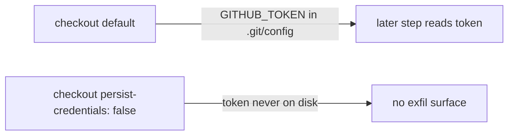

# Harden `markdown-lint.yml` checkout — `persist-credentials: false`

## Summary

The `markdownlint` job in `.github/workflows/markdown-lint.yml` ran
`actions/checkout` with the default `persist-credentials: true`, which writes
the workflow `GITHUB_TOKEN` into `.git/config` as an auth header. This job only
reads the repo and runs `markdownlint-cli2` — it never pushes back or fetches
private submodules — so the persisted credential is unnecessary and only widens
the blast radius of a compromised later step.

Fixed by adding `persist-credentials: false` to the checkout step, matching the
established pattern in the other read-only workflows (`bench.yaml`,
`coverage.yaml`, `actionlint.yml`). Closes #3354.



## Evidence

Backend/CI-only change — no web interface to screenshot.

- `actionlint .github/workflows/markdown-lint.yml` → exit 0.
- New test fails against the unfixed workflow and passes after the fix:

```
.github/workflows/markdown-lint.yml checkout must set persist-credentials: false (Issue #3354) ... FAILED   # before fix
.github/workflows/markdown-lint.yml checkout must set persist-credentials: false (Issue #3354) ... ok       # after fix
```

## Test Plan

- Added `test/ci/WorkflowPersistCredentialsFalse.ts` →
  `.github/workflows/markdown-lint.yml checkout must set persist-credentials: false (Issue #3354)`,
  which parses the workflow YAML and asserts every `actions/checkout` step sets
  `persist-credentials: false`. Verified it fails before the workflow change and
  passes after (regression coverage for #3354).
- Full `WorkflowPersistCredentialsFalse.ts` suite: 8 passed, 0 failed.
