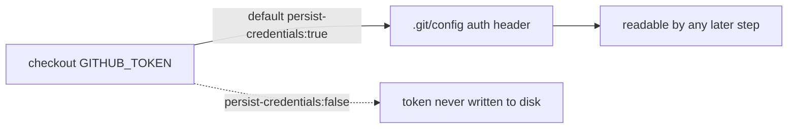

## Summary

Hardened the `publish` workflow so `actions/checkout` no longer persists the
workflow `GITHUB_TOKEN` on disk. By default `actions/checkout` writes the token
into `.git/config` as an auth header, where any later step in the job (including
a compromised dependency pulled during `deno publish`) could read it and act as
the token. The `publish` job only reads the repo, verifies the vendored WASM
package, and publishes to JSR via OIDC tokenless publish (`id-token: write`) —
it never pushes back to the repository or fetches private submodules, so the
persisted credential is unnecessary. Added `persist-credentials: false` to the
checkout step to keep the token off disk. Closes #3355.

This mirrors the existing per-job hardening in `bench.yaml` (#3349),
`coverage.yaml` (#3350/#3351), `dependency-review.yml` (#3352) and
`github-release.yml` (#3353).

## Evidence

Backend/CI change only — no web interface to screenshot. Verified via the CI
audit test suite `test/ci/WorkflowPersistCredentialsFalse.ts`, which parses the
workflow YAML and asserts the checkout step sets `persist-credentials: false`:

```
.github/workflows/publish.yml checkout must set persist-credentials: false (Issue #3355) ... ok
ok | 10 passed | 0 failed
```

`./quality.sh --lint-only` and `actionlint .github/workflows/publish.yml` both
pass cleanly.



## Test Plan

- Added `test/ci/WorkflowPersistCredentialsFalse.ts` →
  `.github/workflows/publish.yml checkout must set persist-credentials: false
  (Issue #3355)`.
  This test fails against the unfixed workflow (`persist-credentials` undefined)
  and passes after adding `persist-credentials: false`.
- Confirmed the full `test/ci/WorkflowPersistCredentialsFalse.ts` suite passes
  (10 tests).
