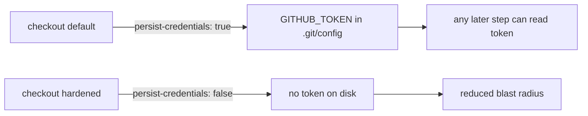

# Harden `shellcheck` workflow checkout — `persist-credentials: false`

## Summary

The `shellcheck` job in `.github/workflows/shellcheck.yml` ran
`actions/checkout` with the default `persist-credentials: true`, which writes
the workflow `GITHUB_TOKEN` into `.git/config` as an auth header for the rest of
the job. This job only reads the repo and lints shell scripts via
`ludeeus/action-shellcheck` — it never pushes back or fetches private
submodules — so the persisted credential is unnecessary and only widens the
blast radius of a compromised step.

Added `persist-credentials: false` to the checkout step, matching the existing
convention already applied across sibling workflows (e.g. `markdown-lint.yml`,
Issue #3354). Closes #3357.

## Evidence

Pure CI workflow YAML change — no web interface or runtime code path to
screenshot. Validated with `actionlint`, which passes cleanly:

```
actionlint .github/workflows/shellcheck.yml   # actionlint OK
```

The checkout hardening flow:



## Test Plan

- `actionlint .github/workflows/shellcheck.yml` — passes.
- Confirmed the added `persist-credentials: false` key matches the indentation
  and commenting convention used by the other hardened workflows in
  `.github/workflows/`.
