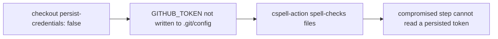

## Summary

The `spellcheck` job in `.github/workflows/spellcheck.yaml` checked out the repo
with `actions/checkout` at its default `persist-credentials: true`, which writes
the workflow `GITHUB_TOKEN` into `.git/config` as an auth header. This job only
reads the repo and runs `streetsidesoftware/cspell-action` — it never pushes
back or fetches private submodules — so the persisted credential is unnecessary
and only widens the blast radius of a compromised step.

Added `persist-credentials: false` to the checkout step so the token is never
written to disk, matching the existing convention across the repo's other
read-only workflows (bench, coverage, dependency-review, markdown-lint, semgrep,
etc.). Closes #3358.

## Evidence

Backend/CI-only change — no web interface to screenshot.

- Extended `test/ci/WorkflowPersistCredentialsFalse.ts` with a test asserting the
  `spellcheck` job checkout sets `persist-credentials: false` (Issue #3358). The
  test failed against the unfixed workflow (`undefined` vs `false`) and passes
  after the fix.
- Full test file result: `12 passed | 0 failed`.
- `deno fmt`, `deno lint`, and `deno check` pass on the modified test file; the
  workflow YAML parses correctly with the new `with.persist-credentials: false`.

## Test Plan

- Added `test/ci/WorkflowPersistCredentialsFalse.ts` ::
  `.github/workflows/spellcheck.yaml checkout must set persist-credentials: false (Issue #3358)`
  — reproduces the finding (fails before the fix) and verifies the fix.
- Ran the full `WorkflowPersistCredentialsFalse.ts` suite to confirm no
  regression in the sibling workflow assertions.
