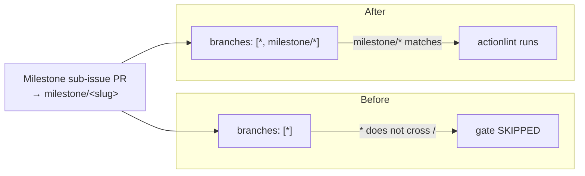

## Summary

The `.github/workflows/actionlint.yml` CI quality gate declared its
`pull_request` trigger with `branches: ["*"]`. A bare `*` glob does not cross a
`/` in GitHub branch filters, so milestone sub-issue PRs — which target a shared
`milestone/<slug>` branch under the planning delivery workflow — never matched
the filter and merged into the milestone branch **without** the actionlint gate
running. The regression was only caught later by the single rollup PR into the
default branch.

The fix adds `milestone/*` to the branch filter (`branches: ["*", "milestone/*"]`)
so the gate runs on milestone PRs too. Milestone branch names have no nested
slashes, so the single-level glob is sufficient. Closes #3359.

## Evidence

Backend/CI change only — no web interface to screenshot.

The gap is a branch-glob matching semantics issue:

New "what" test `test/ci/ActionlintWorkflow.ts::actionlint workflow gate runs on
milestone/* PRs (Issue #3359)` translates each committed branch glob to a RegExp
using GitHub's semantics (`*` stops at `/`, `**` crosses `/`) and asserts the
filter matches `milestone/example-slug`. It fails against the old `["*"]` filter
and passes after the fix — a regression test for the exact gap.

## Test Plan

- Added `test/ci/ActionlintWorkflow.ts::actionlint workflow gate runs on
  milestone/* PRs (Issue #3359)` — reproduces the skip (red on `["*"]`, green on
  `["*", "milestone/*"]`).
- Ran `deno test --allow-read test/ci/ActionlintWorkflow.ts` — 6 passed.
- Ran the full CI test folder (`deno test --allow-read test/ci/*.ts`) — 144
  passed, 0 failed.
- Ran `./quality.sh --lint-only` — formatting, lint, and bash checks clean.
