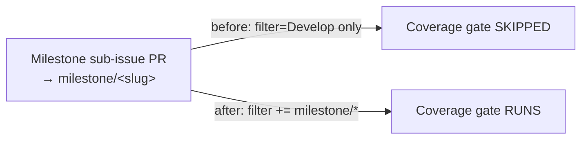

## Summary

The **Test Coverage** CI quality gate (`.github/workflows/coverage.yaml`) only
ran on PRs targeting `Develop`. Milestone sub-issue PRs target a shared
`milestone/<slug>` branch (planning delivery workflow), so the coverage gate
never ran on them and they merged into the milestone branch unchecked — the gap
only surfacing later at the single rollup PR into the default branch.

Added the single-level `milestone/*` glob to the workflow's
`pull_request.branches` filter so the gate runs on every intermediate milestone
PR too. Milestone names are `milestone/<slug>` with no nested slashes, so the
single-level glob is sufficient. The existing `Develop` gate is preserved — the
change is additive.

Closes #3360.

## Evidence

Backend/CI-only change — no web interface to screenshot. Verified via a new
"what" test that parses the committed workflow YAML and asserts on the resulting
`pull_request.branches` filter, plus `actionlint` on the workflow.

Test run (TDD red → green):

- Before the workflow edit: `AssertionError … got: ["Develop"]` (red).
- After: `1 passed`.
- Full `test/ci/` suite: `145 passed | 0 failed`.
- `actionlint .github/workflows/coverage.yaml` → OK.

## Test Plan

- Added `test/ci/CoverageMilestoneBranchFilter.ts` — parses `coverage.yaml` and
  asserts `pull_request.branches` includes both `milestone/*` (the fix) and
  `Develop` (regression guard that the milestone glob is additive, not a
  replacement).
