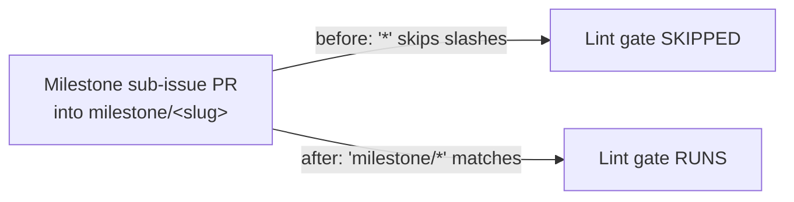

# Markdown Lint gate now runs on milestone PRs (Issue #3361)

## Summary

The Markdown Lint CI quality workflow (`.github/workflows/markdown-lint.yml`)
gated only branches matched by the single `*` glob. In GitHub branch filters `*`
matches a single path segment and does **not** match a slash, so milestone
feature branches (`milestone/<slug>`) never matched. Milestone sub-issue PRs
target that shared branch (planning delivery workflow), so the lint gate never
ran on them and they merged into the milestone branch unchecked — the gap only
surfacing later at the single rollup PR into the default branch.

Fixed by adding the single-level `milestone/*` glob to the workflow's
`pull_request.branches` filter (now `["*", "milestone/*"]`). Milestone names
have no nested slashes, so a single-level glob is sufficient. This mirrors the
same fix already applied to `coverage.yaml` in Issue #3360.

Closes #3361.

## Evidence

Backend/CI-config change only — no web interface to screenshot. Verified via the
new "what" test that parses the committed workflow YAML and asserts the
`pull_request.branches` filter includes `milestone/*` while preserving `*`.



Test run (before fix the milestone test failed; after fix all pass):

```text
ok | 9 passed | 0 failed (44ms)
```

Full quality gate: `./quality.sh` → exit 0, `7644 passed | 0 failed`.

## Test Plan

- Added `test/ci/MarkdownLintMilestoneBranchFilter.ts`:
  - Asserts `pull_request.branches` includes `milestone/*` (reproduces #3361 —
    failed before the fix).
  - Asserts the pre-existing `*` catch-all is preserved (additive, not a
    replacement).
- Existing `test/scripts/MarkdownLintWorkflow.ts` continues to pass unchanged.
