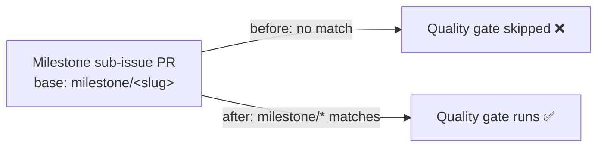

## Summary

The `Quality reviews` CI workflow (`.github/workflows/quality.yml`) only ran on
PRs targeting `Develop`, so it never gated milestone sub-issue PRs. Those PRs
target a shared `milestone/<slug>` branch (planning delivery workflow) and were
merging into the milestone branch unchecked, with the gap only caught later at
the single rollup PR into the default branch.

Added the single-level `milestone/*` glob to the workflow's
`pull_request.branches` filter so the quality gate runs on every intermediate
milestone PR too. Milestone names are `milestone/<slug>` with no nested slashes,
so `milestone/*` is sufficient. The existing `Develop` gate is preserved — the
glob is additive. This mirrors the equivalent coverage-workflow fix (Issue
#3360).

Closes #3362.

## Evidence

Backend/CI-config change with no web interface to screenshot. Verified via a new
"what" test that parses the committed workflow YAML and asserts on the resulting
branch filter.



Test run after the fix:

```
quality.yml pull_request branch filter includes milestone/* (Issue #3362) ... ok
ok | 1 passed | 0 failed
```

Full `test/ci/*.ts` suite: `147 passed | 0 failed`.

## Test Plan

- Added `test/ci/QualityMilestoneBranchFilter.ts` — parses
  `.github/workflows/quality.yml` and asserts `pull_request.branches` includes
  both `milestone/*` (new) and `Develop` (preserved). Confirmed it fails against
  the unfixed workflow (`got: ["Develop"]`) and passes after the fix.
