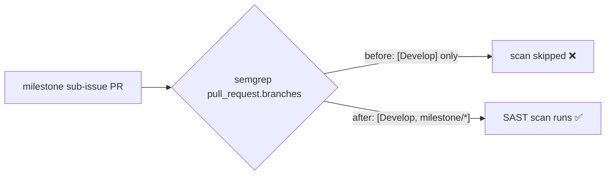

# CI Semgrep workflow now gates milestone PRs

## Summary

The Semgrep SAST quality gate (`.github/workflows/semgrep.yml`) only ran on PRs
targeting `Develop`, so milestone sub-issue PRs — which target a shared
`milestone/<slug>` branch under the planning delivery workflow — merged without
the scan gating them. The gap was only caught later at the single rollup PR into
the default branch.

Added the single-level `milestone/*` glob to the workflow's
`pull_request.branches` filter (mirroring the sibling fix in `coverage.yaml`,
Issue #3360) so the SAST gate runs on every intermediate milestone PR too. The
existing `Develop` gate is preserved — the glob is additive. Milestone names are
`milestone/<slug>` with no nested slashes, so the single-level glob suffices.

Closes #3363.

## Evidence

Backend/CI-config change only — no web interface to screenshot. Verified via a
new test that parses the committed workflow YAML and asserts on the resolved
branch filter.



Test run:

```
semgrep.yml pull_request branch filter includes milestone/* (Issue #3363) ... ok
ok | 1 passed | 0 failed
```

`./quality.sh` passes cleanly: `7652 passed | 0 failed | 4 ignored`.

## Test Plan

- Added `test/ci/SemgrepMilestoneBranchFilter.ts` — parses
  `.github/workflows/semgrep.yml` and asserts `pull_request.branches` includes
  both `milestone/*` and `Develop`. Fails against the pre-fix `["Develop"]`
  filter, passes after the change.
