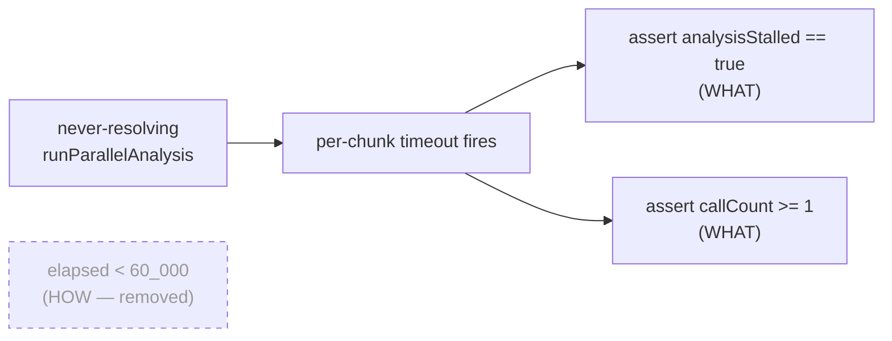

## Summary

Removed a wall-clock timing assertion from a unit test in
`test/ErrorGuidedStructuralEvolution/DiscoverAnalysisPerChunkTimeout.ts`. Closes
#3365.

The test _"runAnalysisLoop aborts runParallelAnalysis mid-flight when it never
resolves"_ measured `const started = Date.now()` …
`const elapsed = Date.now() -
started` and then asserted `elapsed < 60_000`.
That is a **HOW-test** of the runner's real-time performance rather than a
**WHAT-test** of the timeout's observable behaviour. The genuine behaviour under
test — that a never-resolving `runParallelAnalysis` is aborted mid-flight — is
already fully captured two lines earlier by
`assert(perfStats.analysisStalled, …)`. The `elapsed < 60_000` check added
nothing to that contract; it only tied the test to the wall-clock of whatever
machine ran it, so on a loaded CI runner or an ARM-vs-x86 host it could fail
even when the timeout fired correctly.

This is also the exact anti-pattern the project bans in `AGENTS.md` ("Using
timing APIs (`performance.now()`, `Date.now()`) inside `test/` files will cause
flaky, unreliable results because tests run in parallel"), and it was already
removed from the sibling file `DiscoveryTimeout.ts` in Issue #2998 (PR #3011).

### What changed

Applied resolution **(a)** from the issue: deleted the wall-clock assertion and
the now-unused `started`/`elapsed` `Date.now()` measurements, leaving a strictly
behavioural test. The two remaining assertions are pure WHAT-assertions:

- `assert(perfStats.analysisStalled, …)` — the never-resolving driver was
  aborted and the stall recorded.
- `assert(callCount >= 1, …)` — the stubbed driver was invoked before the abort.

No production code changed; the timeout behaviour is unchanged. The file's third
test already models the correct deterministic technique (fake `now` clock via
`advanceNow`, asserting on `analysisStalled` + `callCount`), so the file is now
internally consistent.



## Evidence

Backend/test-only change — no web interface to screenshot. Verified by running
the modified spec:

```
runAnalysisLoop aborts runParallelAnalysis mid-flight when it never resolves ... ok
runAnalysisLoop records no stall when runParallelAnalysis resolves within budget ... ok
runAnalysisLoop defence-in-depth cap aborts remaining chunks ... ok
ok | 3 passed | 0 failed
```

`deno lint`, `deno fmt --check`, and `deno check` all pass for the file.

## Test Plan

- Modified
  `test/ErrorGuidedStructuralEvolution/DiscoverAnalysisPerChunkTimeout.ts`:
  removed the `elapsed < 60_000` wall-clock assertion and the
  `started`/`elapsed` `Date.now()` measurements from the _"aborts
  runParallelAnalysis mid-flight"_ test.
- All three tests in the file still pass; the behavioural contract
  (`analysisStalled`, `callCount >= 1`) is unchanged.
