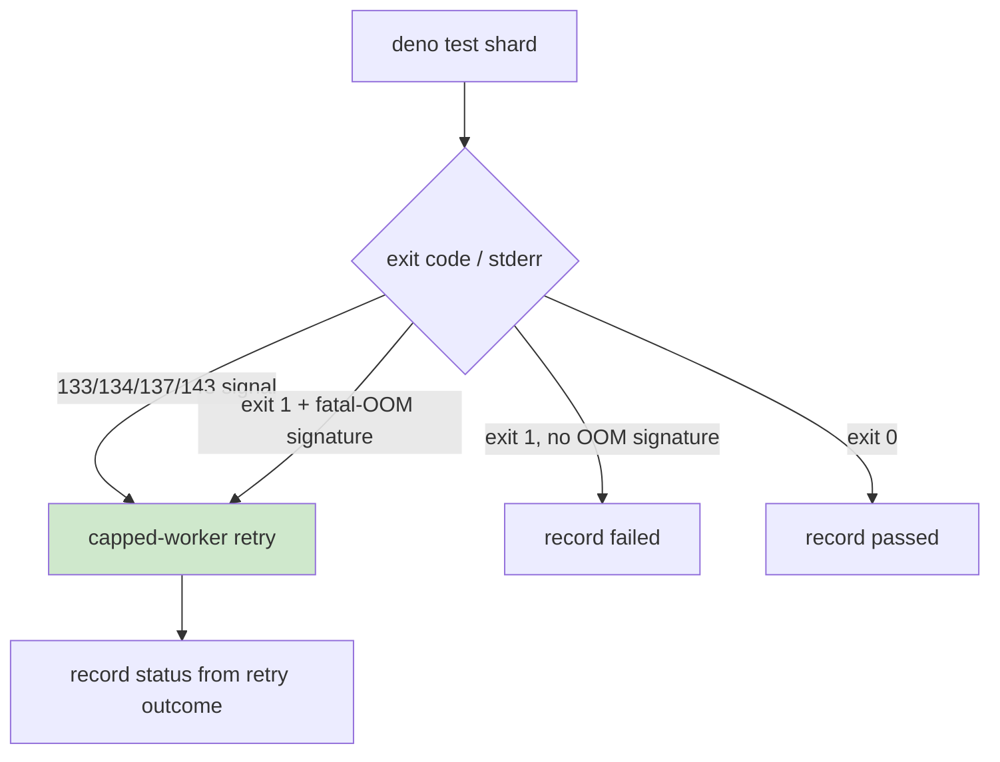

# Coverage shard OOM retry now fires on the V8 fatal-OOM log signature

## Summary

`Coverage shard 2` in the `Test Coverage` workflow flakily hit a **V8 fatal
out-of-memory**
(`Fatal JavaScript out of memory: Ineffective mark-compacts near
heap limit`).
That abort exits the test-runner process with code **1** — not one of the signal
codes (133/134/137/143) — so the existing capped-worker retry never engaged and
the shard failed hard.

This PR broadens the OOM-recovery trigger in `.github/workflows/coverage.yaml`
so recovery fires on **either** a termination signal **or** the fatal-OOM log
signature in the captured stderr, regardless of exit code. The retry decision is
now an `is_oom_failure()` helper that inspects `test-errors.log` for
`Fatal JavaScript out of memory` / `Ineffective mark-compacts` in addition to
the signal codes. Fail-loud behaviour is preserved: a genuine test failure (exit
1 with no OOM signature) is still recorded as `failed`, not retried.

The two other resilience concerns raised in the issue were already resolved in
mainline and are left intact:

- The JUnit-extraction `grep` is already guarded with `|| true`, so a crashed
  shard still records `shard-status-<n>.txt` and uploads partial artifacts.
- Signal code `133` (128+SIGTRAP) already triggers recovery.

Closes #3371.

## Root cause

Before this change the `exit 1 + fatal-OOM signature` edge was missing — an
exit-1 OOM fell through to `record failed` and never retried.

## Evidence

Backend/CI-only change — no web interface to screenshot. Verified via:

- New TDD test
  `test/ci/CoverageOomRetryParallel.ts::"coverage shard OOM
  recovery also fires on the V8 fatal-OOM log signature (exit 1)"`
  — fails against the unfixed workflow, passes after the fix.
- Shell-branch simulation of `is_oom_failure()` under `set -Eeuo pipefail`
  confirming: exit-1 + signature → retry; plain exit-1 → no retry; signal 133 →
  retry; exit 0 → no retry; missing log → no retry; no `set -e` abort.
- `actionlint` (with embedded `shellcheck`) passes on the workflow.
- `./quality.sh --lint-only` passes (fmt, lint, bash checks).
- All 22 coverage-related CI tests pass.

## Test Plan

- Added
  `test/ci/CoverageOomRetryParallel.ts::"coverage shard OOM recovery also
  fires on the V8 fatal-OOM log signature (exit 1)"`
  — asserts the shard run script matches the fatal-OOM log signature and greps
  `test-errors.log` to gate the retry.
- Re-ran the existing OOM-retry, run-plan, and shard-matrix CI suites — all
  green (22 passed).
