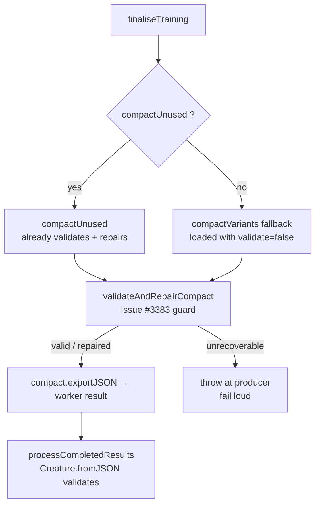

# Fix flaky XOR-evolve: guard the compact training result against orphaned constants

## Summary

The seeded `test/NEAT/Evolve.ts::XOR-evolve` test intermittently crashed in CI's
`Merge coverage & results` job with:

```
ValidationError: constants neuron legacy-neuron-826800409
  has no outward connections  (NO_OUTWARD_CONNECTIONS)
  at creatureValidate (CreatureValidate.ts)
  at loadFrom (CreatureSerialization.ts)
  at Creature.fromJSON
  at processCompletedResults (ProcessCompletedResults.ts)
```

A creature returned by the evolution worker carried a `constant` neuron with no
outward connections. `exportJSON` does **not** validate on the hot path, so the
invariant violation was silent when the worker serialised the result and only
surfaced — non-deterministically, steered by tiny cross-runner floating-point
divergence — when `processCompletedResults` deserialised it **with validation
enabled**.

Root cause: the two compaction producers were asymmetric. The primary
`compactUnused` path already validates and repairs its output
(`validateOrDiagnose` → `fix()`), but the `compactVariants` fallback selected in
`finaliseTraining` loads its result with validation **disabled** and returned it
unchecked. A `constant` neuron stranded with no outward connection (the
`legacy-neuron-` prefix marks a serialised neuron with no `uuid`, i.e. one
produced by the breeding/compaction serialisation path, not in-place mutation)
could therefore reach the worker result unrepaired.

The fix closes the gap at the producer: `finaliseTraining` now validates and
repairs the compact creature via the new `validateAndRepairCompact` guard before
it is serialised into the worker result. `fix()` prunes any constant left with
no outward connection (mirroring the existing `SubConnection`/`compactUnused`
cleanup); if the creature is genuinely unrecoverable the guard **fails loud at
the producer** with full context, rather than letting the fault surface
downstream on deserialisation. This makes the seeded evolution robust to the
floating-point divergence that previously steered it onto the invalid-creature
trajectory.

This is the same recurring class fixed before in #2015, #2016, #2117.

Closes #3383.

## Evidence

Backend/library change — no web interface to screenshot. Verified by reproducing
the exact CI failure and confirming the guard repairs it:

```
pre-repair INVALID: constants neuron legacy-neuron-826800409 has no outward connections
post-repair: VALID ✅   (orphaned constant pruned)
```

Data flow of the fix (the new guard sits between compaction and serialisation):



## Test Plan

New regression suite `test/architecture/training/CompactResultValidation.ts` (4
tests, all passing; RNG-isolated so ordering-sensitive sibling tests stay
deterministic):

- **reproduces the CI validation failure** — a forward-only creature carrying an
  orphaned `constant` (integer id, no `uuid` → `legacy-neuron-<id>`) throws
  `ValidationError` with reason `NO_OUTWARD_CONNECTIONS`, matching the CI stack.
- **`validateAndRepairCompact` prunes the orphaned constant** — after the guard
  the creature is valid, the stranded constant is removed, the valid
  input→hidden→output path is preserved, and it round-trips through the same
  debug-validated `Creature.fromJSON` load that `processCompletedResults`
  performs.
- **leaves a valid creature unchanged** — a well-formed compact creature is a
  no-op (export identical before/after).
- **passes through `undefined`** — no compaction → no work.

Regression checks:

- `test/architecture/training/*.ts` — 30 passed / 0 failed.
- `test/compact/*.ts` — 166 passed / 0 failed.
- `deno fmt`, `deno lint`, and `deno check mod.ts` — clean.
