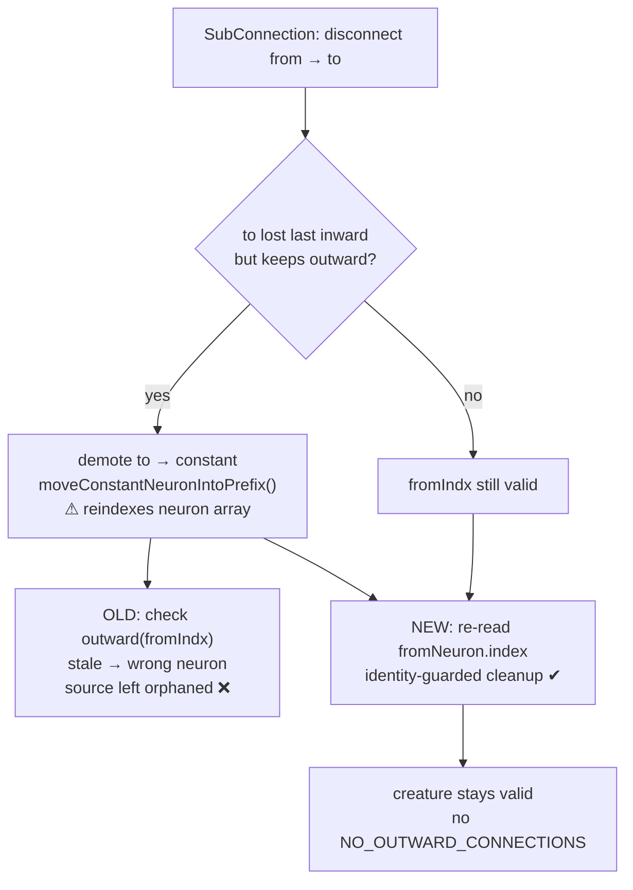

# Fix flaky XOR-evolve: root-cause `SubConnection` stale index + compact producer guard (#3383)

## Summary

The seeded `test/NEAT/Evolve.ts::XOR-evolve` test intermittently crashed in CI's
`Merge coverage & results` job with:

```
ValidationError: constants neuron legacy-neuron-826800409
  has no outward connections  (NO_OUTWARD_CONNECTIONS)
  at creatureValidate (CreatureValidate.ts)
  at loadFrom (CreatureSerialization.ts)
  at Creature.fromJSON
  at processCompletedResults (ProcessCompletedResults.ts)
```

A creature returned by the evolution worker carried a neuron with no outward
connections. `exportJSON` does not validate on the hot path, so the invariant
violation was silent when the worker serialised the result and only surfaced —
non-deterministically, steered by tiny cross-runner floating-point divergence —
when `processCompletedResults` deserialised it **with validation enabled**.

This PR fixes it at two layers — the actual root cause plus defence-in-depth at
the producer. Closes #3383.

### 1. Root cause — stale `from` index in `SubConnection` (this run)

When `SubConnection` disconnects `from → to` and the target `to` loses its last
inward edge while keeping an outward one, `to` is demoted to a `constant` and
moved into the constant prefix via `moveConstantNeuronIntoPrefix`. That move
(and the sibling `removeHiddenNeuron` branch) **reindexes the neuron array**, so
the previously captured integer `fromIndx` now points at a _different_ neuron.
The follow-up "did `from` lose its last outward connection?" cleanup then
inspected the wrong neuron and skipped pruning the genuine source neuron —
leaving a `hidden`/`constant` neuron with **no outward connections**.

The fix captures the source **neuron object** before any topology edit and
re-reads its live `.index` (maintained by `moveNeuronToIndex` /
`removeHiddenNeuron`) when running the source-orphan cleanup, guarded by an
identity check in case an earlier cascade already removed it. This keeps the
topology valid at the producer, failing loud at source rather than on load.



### 2. Defence-in-depth — compact producer guard (prior run on this branch)

Independently, the compaction producers were asymmetric: `compactUnused` only
cleaned up + validated on a _successful_ `removeNeuron`, and the
`compactVariants` fallback selected in `finaliseTraining` loaded its result with
validation disabled. The prior commits on this branch:

- **CompactUnused**: always clean up + validate after a `removeNeuron` attempt,
  not only on success, so a bailed-out removal can't strand a fresh constant.
- **SanitiseCompactVariant** (new): repair (prune orphans → `fix()`) a compact
  candidate, or drop it loudly if unrepairable.
- **finaliseTraining**: route every compact variant through the guard before
  `exportJSON`, so an invalid compact can never be serialised into a result.

Together these mean the orphaned neuron is no longer produced (layer 1), and any
future producer of the same invariant violation fails loud at the producer
rather than downstream on deserialisation (layer 2).

This is the same recurring class fixed before in #2015, #2016, #2117.

## Evidence

Backend/library change — no web interface to screenshot. Verified by test plus a
6000-seed fuzz sweep applying random mutation operators and validating the
creature after every mutation and after safe/aggressive compaction:

- **Before the `SubConnection` fix:** many creatures failed validation with
  `hidden/constant neuron … has no outward connections` after `SubConnection`.
- **After the fix:** 0 outward-connection leaks across 6000 seeds.

The new regression test `test/mutate/SubConnectionStaleFromIndex.ts` fails
against the unfixed operator with
`ValidationError: hidden neuron hidden-from has no outward connections` and
passes after the fix. `XOR-evolve` itself passes end-to-end.

## Test Plan

- Added `test/mutate/SubConnectionStaleFromIndex.ts`: builds a creature whose
  `hidden-to` (highest computational index) demotes to a constant and moves into
  the prefix — forcing a real reindex that shifts `hidden-from` — then loops 200
  seeds asserting the creature (and a JSON round-trip) stays valid after
  `SubConnection`. Reproduces the bug on the unfixed code.
- Prior-run regression suites on this branch:
  `test/compact/SanitiseCompactVariant.ts` and the compact/training coverage.
- Ran `test/mutate/*.ts` (185 passed), `test/compact/*.ts` + `test/breed/*.ts`
  (501 passed), and `test/NEAT/Evolve.ts::XOR-evolve` (passed).
- `deno fmt --check`, `deno lint`, and `deno check` on the changed files —
  clean.
