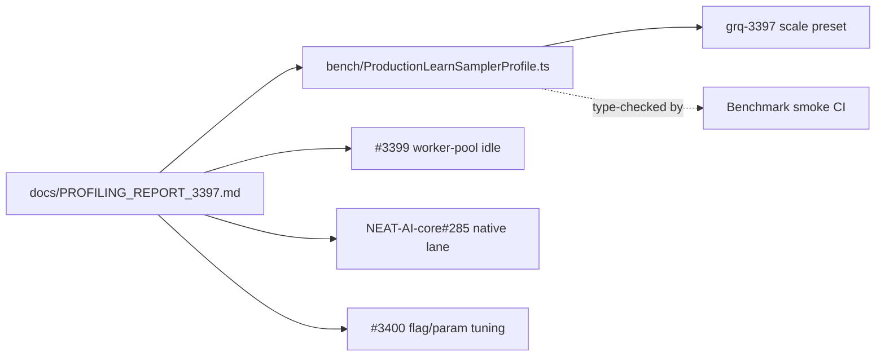

# Profiling report for production learn/sampler runs (Issue #3397)

## Summary

Delivers the foundational **profiling report** for the production learn/sampler
path — the deliverable that the other #3396 sub-issues derive their priorities
from. Closes #3397.

The report (`docs/PROFILING_REPORT_3397.md`) profiles exactly what
`worker/learn.sh` and `worker/sampler.sh` drive, on the GRQ-cluster production
topology (**1,666 neurons, ~21,513 synapses, 2,461 inputs**), with a
reproducible `bench/` command, and:

- gives a wall-clock breakdown of where a production generation spends time;
- confirms the production scoring lane (native vs WASM) with evidence;
- ranks the hotspots and assigns each an owning repo + follow-up sub-issue.

To make the profiling command reproducible against the **exact** production
dimensions, this PR adds:

- a `grq-3397` scale preset in `test/propagate/large/ProductionScaleCreature.ts`
  that deterministically reproduces 1,666 neurons / 21,560 synapses / 2,461
  inputs (seed 3396);
- `bench/ProductionLearnSamplerProfile.ts` — a Deno.bench suite driving
  `evolveDataSet` (pop 20) plus fitness-activation and serialisation
  micro-benchmarks at that topology (type-checked by the **Benchmark smoke** CI
  job on every `bench/**` change, so the report's command cannot silently rot);
- a dimension-lock test so the preset cannot drift without failing CI.

### Key findings (Apple M4 Pro, single worker thread, WASM lane)

| Rank | Phase                          | Mean (ms/gen) |                              % | Owning repo → follow-up                            |
| ---: | ------------------------------ | ------------: | -----------------------------: | -------------------------------------------------- |
|    1 | breeding (main thread, serial) |      11,144.9 |                     **70.0 %** | NEAT-AI → #3399                                    |
|    2 | fitness (activation + error)   |       1,800.0 |                         11.3 % | native lane → NEAT-AI-core#285; scheduling → #3399 |
|    3 | deduplication                  |         586.4 |                          3.7 % | NEAT-AI → #3399                                    |
|    4 | mutation                       |         504.0 |                          3.2 % | NEAT-AI → #3399 / #3400                            |
|  5–6 | resultProcessing + preWarm     |         510.0 |                          3.2 % | NEAT-AI → #3399                                    |
|    — | population/sample-rate/flags   |        config | GRQ + NEAT-AI defaults → #3400 |                                                    |

**Scoring lane confirmed:** env-gated via `getEnvRustScorerConfig()` in
`src/score/RustScorerBridge.ts` (`enabled` defaults to `false`); this run was
WASM (0 `rust_scorer` markers, 16 WASM markers, `NEAT_AI_RUST_SCORER_*` unset).
Production runs the **native lane** via GRQ's
`shared/ensure_neat_ai_native_scorer.sh`, so fitness-lane hotspots are routed to
the companion grill **stSoftwareAU/NEAT-AI-core#285** rather than duplicated
here.

## Evidence

This is a documentation + benchmarking change with no web interface to
screenshot. Evidence is the reproducible profiling command and its captured
output, recorded in `docs/PROFILING_REPORT_3397.md`.

Reproduce with:

```bash
export NO_COLOR=true
deno bench --allow-read --allow-write --allow-env --allow-ffi \
  bench/ProductionLearnSamplerProfile.ts
```

Captured topology line: `topology: 1666 neurons, 21560 synapses, 2461 inputs`.



## Test Plan

- Added
  `test/bench/ProductionScaleEvolveDirProfile.ts::"Production learn/sampler
  creature matches network.json dimensions (grq-3397)"`
  — asserts the preset produces exactly 1,666 neurons / 2,461 inputs and a
  synapse count within 500 of the production 21,513 (deterministic, seed 3396).
  Reproduces the report's topology claim and fails if the preset drifts.
- `./quality.sh --lint-only` and `./quality.sh --check-only` pass (fmt, lint,
  bash check, full-repo type-check).
- Ran `bench/ProductionLearnSamplerProfile.ts` end-to-end to capture the numbers
  in the report.
