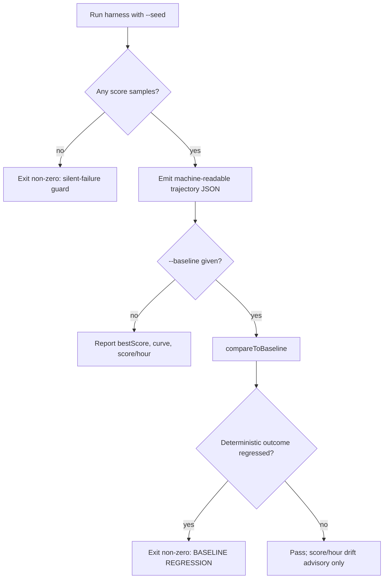

## Summary

Adds the **score-improvement-per-wall-clock-hour benchmark harness** — the
reproducible evidence gate every #3396 implementation sub-issue depends on to
show honest before/after evidence inside a fixed time budget. Closes #3398.

The agreed #3396 success metric is _score improvement per wall-clock hour_
within the learn/sampler time-boxes, not throughput. The harness measures that
metric directly against the production-scale synthetic generators already in
`bench/` (the `grq-3397` preset: 1,666 neurons / ~21,513 synapses / 2,461 inputs
— the `worker/learn.sh` / `worker/sampler.sh` topology).

What landed:

- **`bench/score_per_hour_harness.ts`** — seeded harness that runs
  `evolveDataSet` under a fixed wall-clock budget (or generation cap), records a
  machine-readable **score-vs-time curve** (best/average fitness + cumulative
  elapsed per generation) and derives **score gained per hour**. Accepts an
  optional real `.trainData` sample. Exposes `runScorePerHourHarness`,
  `summariseTrajectory`, `validateHarnessResult`, and `compareToBaseline`.
- **Determinism** — with the defaults (`--train-per-gen=0`,
  `--discovery-sample-rate=-1`) the run is pure seeded neuroevolution, so the
  score trajectory is byte-reproducible. An injectable clock makes the timing
  fields reproducible too, so the determinism smoke test gets byte-identical
  output.
- **Silent-failure guard (Issue #3234)** — the run throws / exits non-zero if it
  produced no score samples, so a wedged learn/sampler invocation surfaces as a
  hard failure rather than an empty report.
- **`bench/score_per_hour_harness_test.ts`** — determinism smoke test, schema
  validation, silent-failure guard, and baseline regression-gate tests; runs in
  the standard `deno test` suite.
- **`bench/baseline_score_trajectory.json`** — checked-in baseline trajectory
  (seeded `grq-3397`, 10 generations) for the regression gate.
- **`.github/workflows/bench.yaml`** — weekly scheduled
  `Score-per-hour
  regression gate` job that runs the harness at the baseline
  config and uploads the trajectory artifact.
- **`deno.json`** — `bench:score-per-hour` task; registers `bench/**/*_test.ts`
  in the test suite (excluded from `deno bench`).
- **Docs** — `docs/SCORE_PER_HOUR_HARNESS.md` guide (with Mermaid flow) + index
  entry.

### Design decisions worth calling out

- **The regression gate is the deterministic evolution outcome, not
  score/hour.** `compareToBaseline` hard-fails when the final best score or the
  per-generation best-fitness trajectory regresses below baseline — this is
  machine-independent (the seeded trajectory is deterministic) and is exactly
  what flags "a change that speeds evolution up but reaches worse scores".
  Score/hour is inherently wall-clock- and machine-load-dependent (observed >10%
  run-to-run swing on the same host), so it is reported as an **advisory
  warning**, not a hard gate, to avoid CI flakiness. This honours the
  guardrail's intent — pure speed at the cost of worse scores is caught —
  without a flaky timing threshold.
- **Test path.** `deno test` only discovers `test.include` globs, so the test
  file at the issue's named path `bench/score_per_hour_harness_test.ts` would
  have been silently skipped by CI. Rather than let it fail silently, the glob
  `bench/**/*_test.ts` was added to `test.include` (and excluded from
  `deno
  bench`) so the test actually runs on every PR.
- **Discovery disabled by default** — the native discovery library adds FFI,
  disk, and timing non-determinism that would break byte-reproducibility, so it
  is off by default and configurable up for a fuller production-faithful run.

### Deno regression avoided

Implemented entirely with Deno-native tooling — `deno run` / `deno test` /
`deno bench` and a `deno.json` task — no Node tooling introduced.

## Evidence

Backend/CLI change — no web interface to screenshot. Verified via tests and
direct harness runs.

Determinism (two runs, same seed → byte-identical score trajectory):

```text
score trajectory identical: True
final identical: True
```

Baseline gate is stable across repeated runs (score/hour drift is advisory):

```text
run 1 gate exit=0
run 2 gate exit=0
Baseline check passed (evolution outcome preserved; score/hour drop 4.62%, final score delta 0).
```

Harness output on the production `grq-3397` topology:

```text
Topology: 1666 neurons, 21560 synapses, 2461 inputs
Generations: 10, best fitness: -1.257652533664427e+31, score/hour: 1.53e+32
```



## Test Plan

New tests in `bench/score_per_hour_harness_test.ts` (all pass,
`7 passed | 0
failed`):

- `identical seeds produce identical score trajectories` — byte-identical
  machine-readable output across two seeded runs + schema validation.
- `a different seed changes the trajectory` — seeding actually varies output.
- `topology matches the requested preset` — exercises the synthetic generators.
- `score/hour is derived from first→last gain over elapsed hours` — metric
  maths.
- `empty trajectory fails loud (silent-failure guard)` — `summariseTrajectory`
  throws on an empty curve (Issue #3234).
- `schema validation rejects malformed output` — `validateHarnessResult`.
- `baseline regression gate flags worse evolution outcome` — a faster-but-worse
  run fails; a pure timing slowdown with unchanged scores passes with an
  advisory warning.

Also run: `deno fmt`, `deno lint bench test`, project-wide `deno check`, and
`markdownlint-cli2` — all clean.
