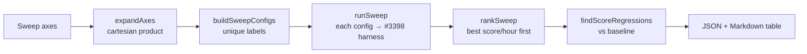

# Tune evolution-mode flags and population/sample-rate for score-per-hour

## Summary

Empirically tuned the evolution-mode flags and population / sample-rate
parameters the production GRQ `worker/learn.sh` / `worker/sampler.sh` scripts
pass, to maximise **score improvement per wall-clock hour** inside the
time-boxes (sub-issue of #3396). Delivers a reusable configuration-sweep tool
over the #3398 score-per-hour harness plus the head-to-head evidence, and files
the cross-repo GRQ follow-up for the GRQ-side script parameters. **Closes
#3400.**

Key outcome: **no NEAT-AI default change is warranted** — the production
settings are already at (or validated against) the score-per-hour optimum on
production-scale data, and no swept configuration improves score-per-hour
without regressing the final score. The evidence-backed recommendation is to
keep the current settings; a cross-repo issue in the downstream production repo
carries the one action that must run in the production backprop environment.

### What changed

- **`bench/evolution_config_sweep.ts`** (new) — deterministic orchestration over
  the score-per-hour harness: expand sweep axes (population × trainingSampleRate
  × sparseRatio × any flag axis) into the cartesian product of labelled configs,
  run each through the harness **in one session on the same synthetic `bench/`
  data**, rank by score-per-hour, and flag any config whose final best score
  regressed below a baseline point (a pure speed-up that reaches a worse score
  is not a win). Emits JSON + Markdown tables as the detection artefact.
- **`bench/score_per_hour_harness.ts`** — added a backward-compatible
  `extraOptions` (`Partial<NeatOptions>`) passthrough so a sweep can vary
  `trainingSampleRate` / `sparseRatio` / evolution-mode flags without a new
  harness field. It is merged **under** the determinism-critical fields (`seed`,
  `populationSize`, `iterations`, `timeoutMinutes`, `trainPerGen`,
  `discoverySampleRate`, and the score sampler), so a sweep can never break
  seeding or the score-vs-time capture.
- **`deno.json`** — new `bench:evolution-sweep` task; sweep test file excluded
  from the `deno bench` glob.
- **Docs** — `docs/EVOLUTION_CONFIG_SWEEP_3400.md` (tool + findings) and a
  `docs/README.md` index entry.
- **Evidence** — `docs/evidence/sweep-3400-*.{json,md}`.

## Evidence

This is a backend/CLI + measurement change — no web interface to screenshot. The
evidence is the score-per-hour sweep tables produced by the new tool on the
production-scale `grq-3397` topology (seed 3396, pure seeded neuroevolution).
Runs are compared in the **same session on the same data**, as the issue's
Failure-Detection section requires.

### Sweep flow

### Population — time-boxed (2-minute budget per config, production-faithful)

| Rank | Config | Population | Gens in box | Final best score |    Score/hour | vs baseline |
| ---: | ------ | ---------: | ----------: | ---------------: | ------------: | ----------: |
|    1 | pop20  |         20 |          13 |       -1.082e+31 | **1.034e+32** |    baseline |
|    2 | pop10  |         10 |          34 |       -1.203e+31 |     6.970e+31 |      −32.6% |
|    3 | pop50  |         50 |           5 |       -9.207e+30 |     6.760e+31 |      −34.6% |
|    4 | pop30  |         30 |           8 |       -1.042e+31 |     5.398e+31 |      −47.8% |

`populationSize=20` (the `learn.sh` value) already maximises score-per-hour in
the learn time-box; `pop10` is faster-generations but reaches a **worse final
score** (flagged as a regression). Larger populations trade score/hour for
better absolute final quality — the rationale for the sampler's 20→50 ramp.

### `trainingSampleRate` / `sparseRatio` — no effect under pure neuroevolution

Every combination of `trainingSampleRate ∈ {0.1, 1.0}` ×
`sparseRatio ∈
{0.05, 0.5}` reached the **identical final best score
(-1.115e+31)** — these knobs only act under backprop training
(`trainPerGen ≥ 1`), which is non-deterministic and cannot be measured by the
in-repo harness. That measurement is handed to the downstream production repo
via a cross-repo issue with the reusable tool.

Full evidence: `docs/evidence/sweep-3400-time-boxed.{md,json}`,
`docs/evidence/sweep-3400-population.{md,json}`,
`docs/evidence/sweep-3400-sample-rate-noop.{md,json}`.

## Recommendation

- **NEAT-AI defaults: no change** — current settings are at/validated against
  the score-per-hour optimum; changing one would be an unbacked regression risk.
- **Downstream production repo:** keep `learn.sh` `populationSize=20` and the
  sampler 20→50 ramp (validated); run the in-situ backprop sweep for
  `trainingSampleRate` / `sparseRatio` — filed as a cross-repo issue in the
  downstream production repo referencing this issue with the evidence.

## Test Plan

- `bench/evolution_config_sweep_test.ts` (new, 15 tests) — axis expansion,
  config materialisation (deep-merge of `extraOptions`), duplicate-label and
  empty-sweep fail-loud guards, entry summarisation, ranking + tie-breaks,
  final-score regression detection (incl. missing-baseline throw), Markdown
  table formatting, and the sequential runner via an injected fake harness.
- `bench/score_per_hour_harness_test.ts` — 2 new tests: `extraOptions` stays
  byte-reproducible + schema-valid, and cannot override the determinism-critical
  fields.
- 24/24 bench tests pass; `deno fmt`, `deno lint`, `deno check`, and
  markdownlint all clean.
