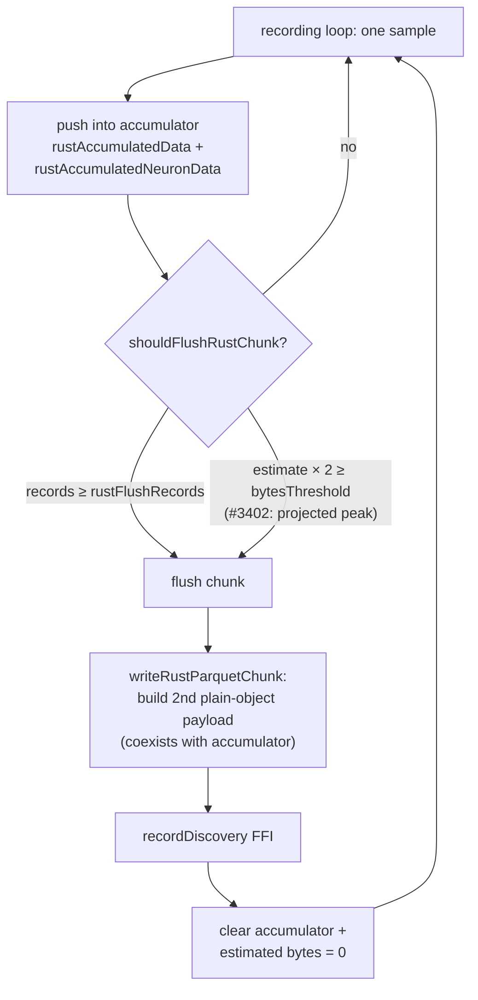

## Summary

Two changes addressing the GRQ-19 single-generation heap OOM (V8 fatal OOM in
`Learn.ts`, heap 789 MB → 4 GB within one generation). **Closes #3402.**

1. **Retainer fix — bound the discovery flush peak.** The one _confirmed_
   unbounded per-sample × per-neuron heap retainer in the evolution engine is
   the discovery record phase (`activateAndTrace` + `record()`), which the repo
   already documents as the OOM retainer `MemoryMonitor` cannot free
   (`AnalysisHeapGuard`, #2594). This is exactly the ".trace store accumulation"
   suspect the issue names. `shouldFlushRustChunk()` decided the flush against
   only the _accumulator_ estimate (`rustAccumulatedEstimatedBytes`), but
   `writeRustParquetChunk()` then materialises a **second**, plain-object FFI
   payload of every pending sample that coexists with the still-live accumulator
   — so the true peak heap at flush is ~2× the estimate. The byte-based flush
   now fires against that projected peak, keeping accumulator + transform copy
   under `rustFlushBytesThreshold` instead of overshooting it by the copy.

2. **Telemetry fix — population topology averages.** The memory-profile line
   carried `avg_neurons=0 avg_synapses=0`, so a heap that ballooned in one
   generation could not be attributed to runaway topology.
   `GenerationCompleteEvent` now carries `averageNeurons` / `averageSynapses`,
   computed alongside the existing squash histogram in `evolve()`.

### Investigation note (scope honesty)

The reported Learn flags include `--discoverySampleRate=0`, which
`scheduleDiscovery` treats as "discovery off" (`discoverySampleRate <= 0`
returns early) and which makes the discovery sample size
`ceil(records × 0) = 0`. The active heavy paths for those flags (batch scoring,
CRISPR, per-generation training) were all audited and found to reuse
pre-allocated buffers or clear their per-generation state — none retains
unbounded per-sample data on the main isolate. Because Deno Workers are separate
V8 isolates in the same process, a training/discovery **worker** isolate can
independently reach the `--max-old-space-size` cap while the main-isolate
memprofile still reads `heap=789`. This PR fixes the confirmed unbounded
retainer of that class (the discovery record accumulation) and adds the topology
telemetry the issue explicitly requested so the exact production spike can be
confirmed from a heap snapshot on the next occurrence.

## Evidence

Backend/CLI change — no UI to screenshot. Verified by the full quality gate
(`./quality.sh`): formatting, lint, bash-syntax, type-check, discovery build,
WASM sync, and the full test suite — **7670 passed / 0 failed**.

### Flush peak accounting

Before #3402 the flush compared only the accumulator estimate against the
threshold, so real peak (accumulator + the transform payload built at `T`)
overshot `rustFlushBytesThreshold` by the size of the copy. Multiplying the
estimate by `RUST_FLUSH_PEAK_COPY_MULTIPLIER` (= 2) flushes early enough that
the peak stays under the configured threshold. The record-count ceiling
(`rustFlushRecords`) is unchanged.

## Test Plan

- `test/NEAT/TopologyAverages.ts` — `computeTopologyAverages` happy path, cross-
  population averaging, empty-population zeroes (not `NaN`), and the
  monotonicity signal (larger topology ⇒ larger averages).
- `test/config/TrainingEvent.ts` — extended the `generation_complete` structure
  assertion to require finite, strictly-positive `averageNeurons` /
  `averageSynapses` on the emitted event.
- `test/ErrorGuidedStructuralEvolution/RustFlushPeakCopy.ts` —
  `shouldFlushRustChunk` fires once the projected ~2× peak crosses the byte
  threshold, does **not** fire while the projected peak is under it, and still
  honours the record-count ceiling.
- Full `./quality.sh` gate: 7670 passed / 0 failed.
