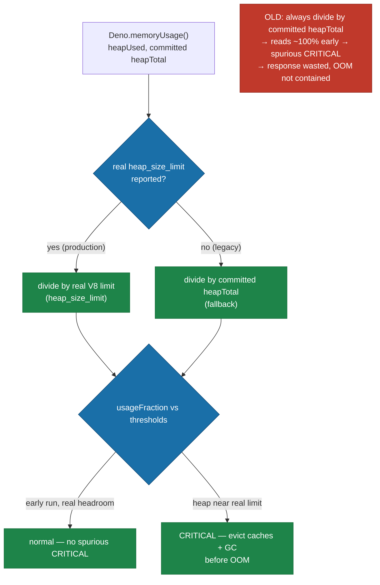

## Summary

The `MemoryMonitor` misread the V8 heap limit, so its pressure thresholds and
CRITICAL response were meaningless — it went CRITICAL early with gigabytes of
headroom and never contained the real gen-2 heap growth that OOM-aborted the
GRQ-21 `learn` run (exit 133). This fixes the library-side root cause. **Closes
#3410.**

Root cause (issue defect #2): `checkMemoryAndEvict` computed
`usageFraction = heapUsed / heapTotal`, where `heapTotal` is the
**dynamically-committed** heap from `Deno.memoryUsage()`. Committed `heapTotal`
starts far below the configured `--max-old-space-size` and grows on demand, so
early in a run `heapUsed / heapTotal` reads ~100% and fires a spurious CRITICAL
while the real limit is untouched. On GRQ-21 the **4373 MB** V8 limit was
misread as **676 MB** (the committed heapTotal at that moment).

The fix reads the **real** V8 old-space limit via `node:v8`
`getHeapStatistics().heap_size_limit` — the same source `WorkerHeapBudget`
already uses — and measures pressure against it, falling back to committed
`heapTotal` only when the runtime cannot report a limit (legacy behaviour). The
`[MemoryMonitor] Heap: <used> / <limit> (<pct>%)` log line and the emitted
`memory_pressure` training event now both report the real ceiling.

This also addresses the containment side of defect #1 (residual heap growth
post-#3403): with the limit read correctly, the CRITICAL response no longer
fires spuriously early **and** genuinely fires when the heap approaches the real
limit, so cache eviction / proactive GC actually run before the V8 OOM abort
rather than being wasted on a false alarm. The change does not depend on
reducing `popSize` (GRQ#3472 keeps population = 20).

### What changed

| File                             | Change                                                                                                                                                                                                                                                                                                                        |
| -------------------------------- | ----------------------------------------------------------------------------------------------------------------------------------------------------------------------------------------------------------------------------------------------------------------------------------------------------------------------------- |
| `src/NEAT/MemoryMonitor.ts`      | New `readHeapLimit()` (reads `heap_size_limit`); `defaultMemoryUsageProvider` populates `heapLimit`; `checkMemoryAndEvict` divides by the real limit (fallback to `heapTotal`) and returns `heapLimit`; `logMemoryUsage` logs against the real limit. `MemoryUsageSample` / `MemoryCheckResult` gain an optional `heapLimit`. |
| `src/NEAT/NeatEvolution.ts`      | Both `memory_pressure` events report `heapLimit` (real limit) instead of committed `heapTotal`.                                                                                                                                                                                                                               |
| `docs/troubleshooting/MEMORY.md` | Documents that thresholds are measured against the real V8 limit, not committed `heapTotal`.                                                                                                                                                                                                                                  |

## Evidence

Backend/library change — no web interface to screenshot. Verified via the unit
tests below (all 40 tests in `test/NEAT/MemoryMonitor.ts` pass, including the 7
new #3410 cases):

```
checkMemoryAndEvict measures usage against the real heap limit, not committed heapTotal (#3410) ... ok
checkMemoryAndEvict fires critical when heap actually approaches the real limit (#3410) ... ok
checkMemoryAndEvict falls back to committed heapTotal when no real limit is reported (#3410) ... ok
checkMemoryAndEvict ignores a non-positive heap limit and falls back to heapTotal (#3410) ... ok
readHeapLimit reports the real V8 old-space limit (#3410) ... ok
defaultMemoryUsageProvider populates the real heap limit (#3410) ... ok
logMemoryUsage logs against the real heap limit when present (#3410) ... ok
ok | 40 passed | 0 failed
```

The first case is the direct regression reproduction: a sample with
`heapUsed = 650 MB`, committed `heapTotal = 676 MB` (≈96% of committed), and the
real `heapLimit = 4373 MB` now reports **normal** (~15%) instead of the old
spurious **critical**.



## Test Plan

Added to `test/NEAT/MemoryMonitor.ts` (7 new tests, real functions with test
data asserting behaviour — no source-grep tests):

- `checkMemoryAndEvict measures usage against the real heap limit, not committed heapTotal (#3410)`
  — regression repro (676 MB committed vs 4373 MB real limit → normal, no
  eviction).
- `checkMemoryAndEvict fires critical when heap actually approaches the real limit (#3410)`
  — 4.2 GB against 4373 MB → critical, caches evicted.
- `checkMemoryAndEvict falls back to committed heapTotal when no real limit is reported (#3410)`
  — legacy path preserved.
- `checkMemoryAndEvict ignores a non-positive heap limit and falls back to heapTotal (#3410)`
  — guards a zero/invalid limit.
- `readHeapLimit reports the real V8 old-space limit (#3410)` — returns a
  positive number.
- `defaultMemoryUsageProvider populates the real heap limit (#3410)` — sample
  carries `heapLimit >= heapTotal`.
- `logMemoryUsage logs against the real heap limit when present (#3410)` — log
  denominator is the real limit, not committed heapTotal.

All 33 pre-existing `MemoryMonitor` tests remain unchanged and pass, plus
`PreFitnessMemoryEviction`, `MemoryPressureCacheCorrelation`, and
`TrainingEventEmitter` suites (60 passed).

## Scope note

Defect #2 (the misread limit) is the well-defined library root cause and is
fully fixed here. Correcting it also makes the CRITICAL response meaningful,
which is the library-side containment for defect #1's residual heap growth. The
downstream GRQ containment (bounded exit-133 retry, low-memory heap-budget
tuning) is tracked separately in stSoftwareAU/GRQ#3508.
