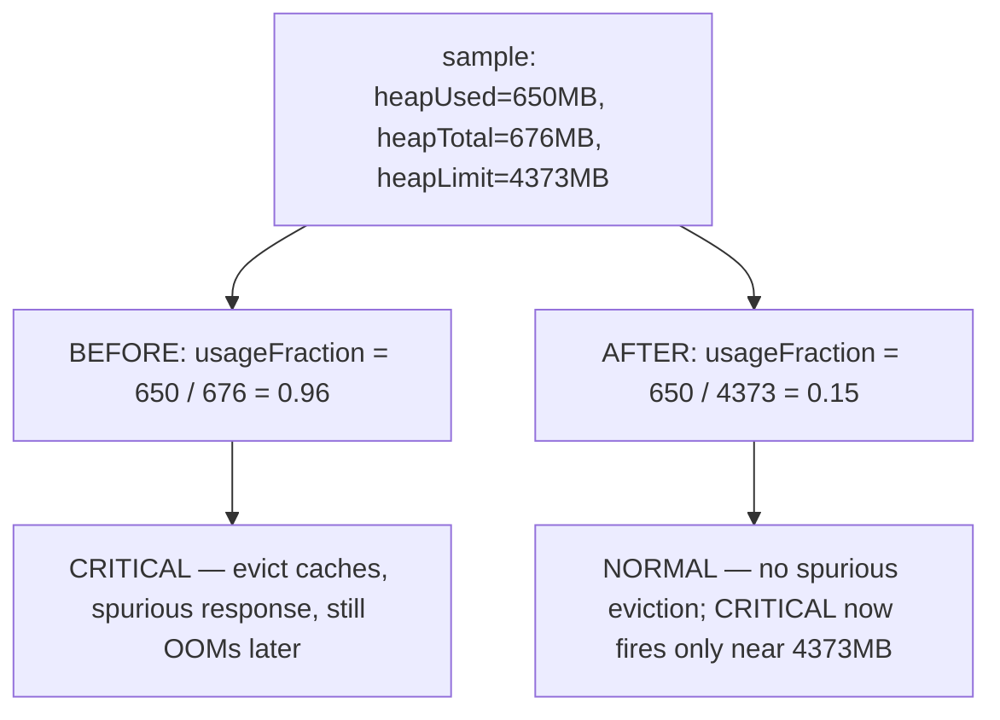
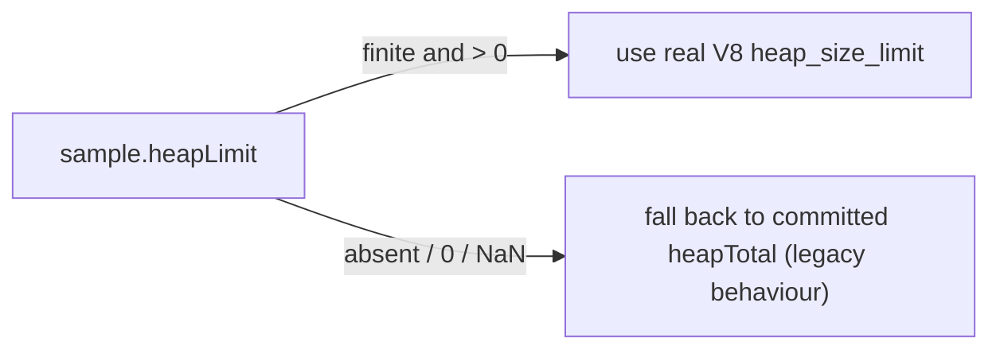

## Summary

Fixed the `MemoryMonitor` heap-limit misread that let the GRQ `learn` stage OOM
on an 8 GB host (Issue #3410). The monitor computed heap pressure as
`heapUsed / heapTotal`, where `heapTotal` is `Deno.memoryUsage().heapTotal` —
the **committed** heap that starts small (~676 MB observed) and grows on demand
— not the real V8 old-space **limit** (`--max-old-space-size`, ~4373 MB on the
host). This made the usage fraction, the WARNING/CRITICAL thresholds, and the
CRITICAL response meaningless: the monitor read CRITICAL against the tiny
committed heap early in the run, fired its cache-eviction response uselessly,
and never tracked true proximity to the OOM ceiling

The fix reads the real limit from `node:v8`
`getHeapStatistics().heap_size_limit` (the same mechanism already used by
`WorkerHeapBudget.ts` / `WorkerHandlerBase.ts`) and divides `heapUsed` by that
limit instead. Now the pressure level, thresholds, snapshot, and the emitted
`memory_pressure` training event all reflect the genuine OOM ceiling, so the
graduated eviction and proactive-GC response fire at the right time — when
`heapUsed` actually approaches the real limit — giving them a chance to relieve
pressure before V8 aborts.

`Closes #3410.`

### Scope note

This library-side change addresses defect 2 (the misread limit), which is the
root cause of why the monitor's CRITICAL response "fired without preventing the
OOM" in defect 1: with a correct denominator the monitor's warning/critical
responses are now meaningful and actionable near the true limit. Downstream
containment (wiring `learn.sh` into the bounded exit-133 retry and tuning the
low-memory-profile heap budget) is owned by stSoftwareAU/GRQ#3508, per the
issue. No change depends on reducing `popSize` (GRQ#3472 keeps it at 20).

### Deno regression avoided

- Read the V8 heap limit via the existing `node:v8` `getHeapStatistics()` API
  (already used elsewhere in this Deno repo) rather than introducing any
  Node-only tooling.

## Evidence

Backend/library change with no web interface — verified via unit tests
(`deno test`), not screenshots.

Behaviour before vs after, for the reproduced GRQ-21 sample (`heapUsed=650 MB`,
committed `heapTotal=676 MB`, real `heapLimit=4373 MB`):

Denominator selection (`resolveHeapLimit`):

## Test Plan

Added to `test/NEAT/MemoryMonitor.ts`:

- `resolveHeapLimit prefers the real heapLimit over committed heapTotal (#3410)`
- `resolveHeapLimit falls back to heapTotal when heapLimit is absent or bogus (#3410)`
  — covers absent, `0`, negative, and `NaN` limits (never divides by a bogus
  value).
- `defaultMemoryUsageProvider reports the real V8 heap limit above committed heapTotal (#3410)`
  — asserts the provider now surfaces `heap_size_limit ≥ heapTotal`.
- `checkMemoryAndEvict measures usageFraction against heapLimit, not heapTotal (#3410)`
  — the regression test: the 650/676-vs-4373 misread now reads NORMAL, and no
  spurious CRITICAL cache eviction fires.
- `checkMemoryAndEvict goes CRITICAL when heapUsed nears the real heap limit (#3410)`
  — 4200 MB against the 4373 MB limit correctly trips CRITICAL.
- `checkMemoryAndEvict preserves legacy heapTotal fallback when no heapLimit provided (#3410)`
  — providers without a limit behave exactly as before.
- `captureMemorySnapshot records the real heap limit (#3410)`.

Existing `MemoryCheckResult` / `MemorySnapshot` literals in the tests were
updated to include the new required `heapLimit` field, and the snapshot format
assertion now checks the added `limit=` field. All 47 tests across
`test/NEAT/MemoryMonitor.ts` and `test/NEAT/PreFitnessMemoryEviction.ts` pass,
and the 22 `AnalysisHeapGuard` tests (shared provider) remain green.

## Files changed

- `src/NEAT/MemoryMonitor.ts` — read `heap_size_limit`; add `heapLimit` to
  `MemoryUsageSample`, `MemoryCheckResult`, `MemorySnapshot`; new
  `resolveHeapLimit`; divide by the real limit; report the limit in the log and
  snapshot.
- `src/NEAT/NeatEvolution.ts` — emit the real `heapLimit` (not `heapTotal`) in
  both `memory_pressure` training events.
- `test/NEAT/MemoryMonitor.ts` — new tests + literal/field updates.
