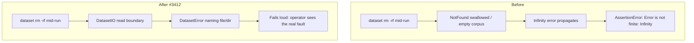

# PR Summary — Issue #3412

## Summary

A training dataset that vanishes mid-run — the `.trainData-binary*/` directory
or a `.bin` file deleted out from under a running discovery (e.g. a background
disk-cleanup sweep `rm -rf`s the directory while an iteration holds hundreds of
files open) — used to fail with a **misleading**
`AssertionError: Error is not
finite: Infinity`. The missing data was swallowed
at the I/O boundary and re-surfaced far downstream in the finite-error
assertion, so the operator debugged a numeric-stability problem instead of the
real fault (the dataset disappeared).

This change makes a vanished dataset **fail loud and clear** at the I/O boundary
(Issue #3234 — never fail silently): a new typed `DatasetError` names the
missing file/directory and carries a discriminating `reason`, thrown before the
missing data can propagate into scoring.

`Closes #3412.`

### What changed

- **New typed error** `src/errors/DatasetError.ts` — `DatasetError` with
  `reason` (`DIRECTORY_MISSING` | `FILE_MISSING` | `NO_DATA_FILES`) and a `path`
  field naming the offending dataset file/directory. Re-exported from the public
  barrel (`mod.ts`).
- **New fail-loud I/O helper** `src/architecture/DatasetIO.ts` —
  `openDatasetFileSync`, `readDatasetFileSync`, and `readDatasetDirEntriesSync`
  translate `Deno.errors.NotFound` into a `DatasetError` naming the path and
  re-throw every other error unchanged.
- **Applied at every binary-dataset read boundary**: `evaluateDir`
  (`CreatureActivation.ts`, the scoring path in the report), `dataFiles`
  (`TrainingSetup.ts`), the training epoch loop (`TrainingEpoch.ts`), the inline
  `trainDir` loop (`CreatureTraining.ts`), cross-validation
  (`CrossValidationTrainer.ts`), and k-fold splitting (`KFoldSplitter.ts`).
- **Empty file list** in `evaluateDir` / `trainDir` now throws a `NO_DATA_FILES`
  `DatasetError` naming the directory instead of a bare
  `assert(files.length > 0, "No data files found")`.

### Data flow



## Evidence

Backend/CLI change — no web interface to screenshot. Verified by new automated
tests (all pass) exercising real functions with real temp datasets:

```
deno test -A test/errors/DatasetError.ts test/architecture/DatasetIO.ts \
  test/creature/EvaluateDirVanishedDataset.ts
ok | 14 passed | 0 failed
```

The key regression test builds a real binary corpus, `rm -rf`s it, then calls
`creature.evaluateDir(...)` and asserts a `DatasetError`
(`reason:
DIRECTORY_MISSING`, `path` = the deleted dir) is thrown — **not** an
`AssertionError: Error is not finite: Infinity`.

## Test Plan

- `test/errors/DatasetError.ts` — constructor, `reason`/`path`/`name` fields,
  `instanceof Error`, selective catch, typed reasons.
- `test/architecture/DatasetIO.ts` — `openDatasetFileSync` /
  `readDatasetFileSync` on a missing file → `FILE_MISSING`;
  `readDatasetDirEntriesSync` on a vanished dir → `DIRECTORY_MISSING`;
  happy-path open/read/list on real temp files.
- `test/creature/EvaluateDirVanishedDataset.ts` — regression tests:
  `evaluateDir` on a vanished directory → `DatasetError(DIRECTORY_MISSING)`; a
  `.bin` file missing from the cached list → `DatasetError(FILE_MISSING)`; an
  empty dataset directory → `DatasetError(NO_DATA_FILES)`.
- `test/architecture/PublicAPI.ts` — `DatasetError` is exported and
  constructable from the public barrel.

## Notes

- **Repository isolation / Deno-native:** the fix lives entirely inside this
  repo and uses Deno-native `Deno.errors.NotFound`; no Node tooling introduced.
- **Scope:** the upstream deletion itself is tracked separately in a cross-repo
  issue in the downstream production repo; this change only makes the surfacing
  loud and clear as the issue requested.
