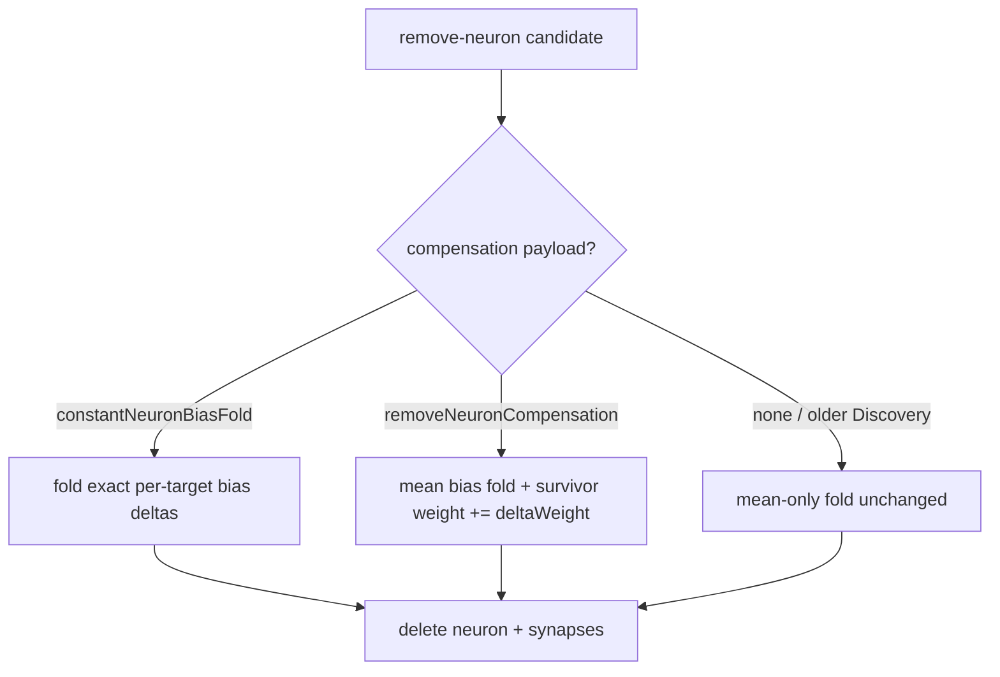

# PR Summary — Remove-neuron applier consumes NEAT-AI-Discovery compensation data

## Summary

The NEAT-AI remove-neuron applier folded only a removed neuron's **mean**
downstream contribution into the downstream biases (the "mean-only fold"). For a
variance-carrying neuron this drops the per-sample signal and reproduces the
NEAT-AI-Discovery #1686 regression class. This PR makes the applier consume the
variance-aware compensation now emitted by NEAT-AI-Discovery instead:

- **#1559 / #1689 — weight redistribution** (`removeNeuronCompensation`): for a
  variance-carrying candidate, bump the correlated survivor's synapse weight into
  the shared target by `deltaWeight` **in addition to** the mean bias fold.
- **#1623 / #1690 — constant bias fold** (`constantNeuronBiasFold`): for a
  functionally-constant candidate, apply the pre-computed exact per-target bias
  deltas.
- **No compensation present** → byte-identical fallback to today's mean-only
  fold, so mixed-version pipelines are provably unchanged.

Propose-and-evaluate is preserved: the applier applies the remedy the pipeline
chose; it does not re-gate removals.

Fixes #3414. Companion to stSoftwareAU/NEAT-AI-Discovery#1691 (parent
NEAT-AI-Discovery#1686).

### Changes

- **Wire types** (`RustDiscoveryTypes.ts`): `RustRemoveNeuronCompensation`,
  `RustConstantNeuronBiasFold`, `RustFoldedBiasDelta`,
  `RustRemoveNeuronCompensationData`; optional fields on
  `RustCoordinatedStructuralCandidate` and `RustRemovalCandidate`.
- **TS types** (`CoordinatedStructuralCandidate.ts`): `RemoveNeuronCompensation`,
  `ConstantNeuronBiasFold`, `FoldedBiasDelta`, `RemoveNeuronCompensationData`;
  optional fields on `CoordinatedStructuralCandidate`, `CandidateHarmfulNeuron`,
  and `RemovalCandidate`.
- **Parse** (`DiscoverAnalysis.ts`, `DiscoverResult.ts`): carry the compensation
  payload through the Rust→TS mapping.
- **Applier** (`DiscoveryNeuronRemoval.ts`): new exported pure helper
  `applyRemoveNeuronCompensation` (constant fold / variance redistribution /
  `none`), reused by `removeHarmfulNeuron`, `removeLowImpactNeuron`, and
  `applyCoordinatedStructuralCandidate` (the live consumer of the emitted
  payload). The mean-only fold is retained untouched as the fallback branch.
- **Cosmetic** (`CandidateDescriptions.ts`): `shortID` no longer mangles a
  single-dash numeric neuron id — `neuron-876870118` was rendered as `76870118`
  (leading digit + prefix dropped); only multi-dash hyphenated UUIDs are
  abbreviated now.

### Compensation routing

## Evidence

Backend/CLI change — no web interface to screenshot. Verified via `deno test`,
`deno check` (repo-wide), `deno lint`, and `deno fmt`.

Parity note: the weight redistribution supplements the mean bias fold. On a
covariance-bearing eval set with a zero-mean survivor and a perfectly correlated
removed neuron, the reconstructed output matches the pre-removal output exactly
(`redistributedResidualVariance = 0`), whereas the mean-only fold leaves a
per-sample residual — parity-or-better, as required by NEAT-AI-Discovery#1686.

## Test Plan

- Added `test/ErrorGuidedStructuralEvolution/DiscoveryNeuronRemoval.ts` covering
  the three failure-detection cases:
  1. variance candidate — survivor weight bumped by `deltaWeight` **and** bias
     fold applied; reconstructed output matches pre-removal on the covariance
     eval set (parity-or-better vs the mean-only fold);
  2. constant candidate — folded bias deltas land exactly;
  3. empty payload — helper reports `none` and makes no change (byte-identical
     mean-only fallback), plus end-to-end `applyCoordinatedStructuralCandidate`
     variance and constant integration tests.
- Added a `shortID` regression test in `test/discovery/CandidateDescriptions.ts`
  asserting `neuron-876870118` is rendered whole.
- Existing `DiscoveryApplication.ts`, coordinated-structural, and
  `DiscoveryMessageFormatting.ts` suites stay green.
