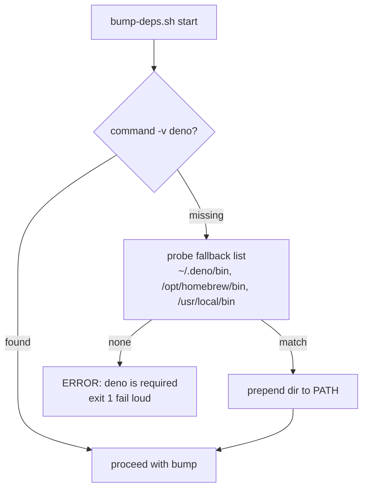

# Harden bump-deps.sh against a missing deno on the worker PATH

## Summary

Dependency bumps on host Mac-Ultra-M2 were rejected because `bump-deps.sh`'s
`command -v deno` pre-flight failed: the Vibe Coder worker spawns the script
with the unattended launchd/cron PATH, which lacks `~/.deno/bin` (the official
installer location). The bump was reverted and PR #3416 shipped without it.

The root cause is worker-side and tracked separately as
`stSoftwareAU/VibeCoding#3532`. This PR adds a **local defence-in-depth layer**:
when `command -v deno` fails, `bump-deps.sh` now probes the known install
locations — `~/.deno/bin/deno`, `/opt/homebrew/bin/deno`, `/usr/local/bin/deno`
(first match wins) — and prepends the winner's directory to `PATH` so every
later `deno` call resolves. When no candidate exists it still **fails loud**
with the existing `ERROR: deno is required` message and exit 1, so the worker
reverts per VibeCoding#1613 — no silent skip.

The fallback list is overridable via `BUMP_DEPS_DENO_FALLBACKS` (a
colon-separated test seam) that defaults to the three canonical locations.

Closes #3417.

> Note: the verify-and-close step in the issue depends on VibeCoding#3532
> landing on an affected host; this PR delivers the hardening half, which does
> not depend on the worker fix.

## Deno regression avoided

Implemented the probe as native bash within the existing Deno-repo tooling — no
Node-only helper or dependency introduced.

## Evidence

Backend/CLI change (a bash script) — no web interface to screenshot. Verified
via the `deno test` specs below.

Targeted run (`deno test --allow-all test/scripts/BumpDepsScript.ts`): all 13
specs pass, including the two new Issue #3417 specs.

## Test Plan

Added to `test/scripts/BumpDepsScript.ts`:

- `bump-deps.sh resolves deno from ~/.deno/bin fallback when PATH lacks it
  (Issue #3417)`
  — stubs a deno binary under a temp `HOME/.deno/bin`, runs the script with a
  PATH that excludes deno, and asserts exit 0 with no `deno is required` error.
  Reproduces the #3416 failure against the unfixed script (which would exit 1)
  and passes after the fix.
- `bump-deps.sh fails loud when deno is absent and no fallback exists
  (Issue #3417)`
  — points `BUMP_DEPS_DENO_FALLBACKS` at non-existent binaries with a deno-free
  PATH and asserts non-zero exit plus the fail-loud `deno is required` message.

All existing `BumpDepsScript.ts` specs continue to pass unchanged.
