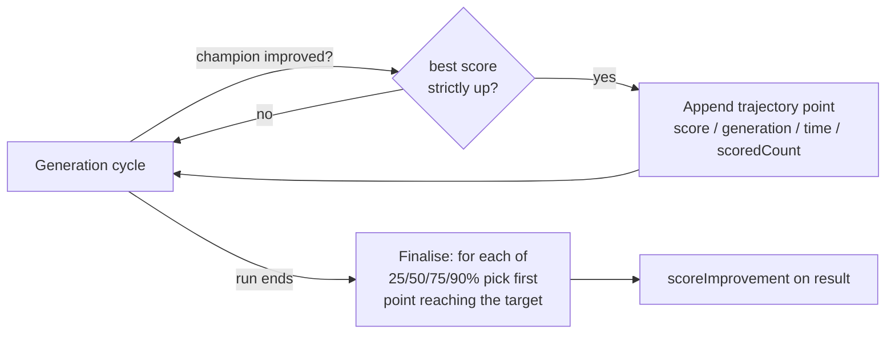

# Record population size and options in evolve statistics (Issue #3422)

## Summary

The run-level result returned by `evolveDir`/`evolveDataSet`/`evolveEnv`/
`evolveRL` (the shape GRQ-cluster persists as `result.json`) previously reported
only `error`, `score`, `generation`, `time`, `phaseTimingTotals` and
`scorerUtilisation` — enough to see a run's outcome but not enough to compare
configurations across machines or judge which gives the best rate of score
improvement. This PR adds the missing tuning inputs so each run is
self-contained. Judging "optimal" (most variants checked per hour, best rate of
score gain) happens downstream; the library only records the data. **Closes
#3422.**

New fields on every `evolve*` result:

- **`populationSize`** — configured population size, always recorded explicitly
  (the primary tuning variable), even when it came from a default.
- **`finalPopulationSize`** — final effective population size, present **only**
  when adaptive population sizing (`AdaptivePopulationConfig`) is enabled.
- **`requestedOptions`** — echo of just the options the caller requested
  (changes from defaults, not the full resolved config). Function/callback
  options are recorded as `"[function]"` and non-serialisable values as
  `"[unserialisable]"` — recorded by name with a marker rather than dropped
  silently.
- **`hardware`** — CPU cores, total memory and host identifier for cross-machine
  comparison. Best-effort fields degrade to `null` (never throw) when
  `--allow-sys` is not granted.
- **`scoreImprovement`** — a milestone summary of the score-improvement curve:
  the time, generation and cumulative scored-count when the run reached
  25/50/75/90% of its total improvement. Computed at run end from a compact
  in-memory best-score trajectory that only grows on a champion improvement — no
  per-generation series is kept or persisted (the issue explicitly does not want
  a large JSON).

The existing throughput counters (`generation`, `scorerUtilisation` scored
count, `time`) are unchanged; per-hour rates remain the caller's to derive.

### Design

The additions live in four small, single-responsibility modules so each piece is
testable in isolation, and a shared `EvolveResult` type replaces the four
previously-inlined return shapes (DRY):

- `src/creature/EvolveHardwareDescriptors.ts` — `captureHardwareDescriptors()`
- `src/creature/EvolveOptionsEcho.ts` — `serialiseOptionsEcho()`
- `src/creature/ScoreImprovementMilestones.ts` — trajectory + milestone
  finaliser
- `src/creature/EvolveRunStatistics.ts` — `buildEvolveRunStatistics()` +
  `EvolveResult`

## Evidence

Backend/library change — no web interface to screenshot. Verified via the unit
and integration tests below (all pass) and the full `./quality.sh` gate
(`7754 passed | 0 failed`).

The score-improvement milestones are derived from a compact trajectory that only
grows when the best score improves — nothing per-generation is stored:

### Deno regression avoided

Hardware capture uses native `navigator.hardwareConcurrency`, `Deno.hostname()`
and `Deno.systemMemoryInfo()` rather than any Node `os` module — no Node tooling
or dependency was introduced.

## Test Plan

New unit tests (pure helpers):

- `test/creature/EvolveOptionsEcho.ts` — echoes serialisable options, records
  functions/non-serialisable values by marker, skips `undefined`, deep-clones
  nested values.
- `test/creature/ScoreImprovementMilestones.ts` — empty/single-point/no-gain
  edge cases, first-point-reaching-each-fraction selection, single big jump.
- `test/creature/EvolveHardwareDescriptors.ts` — descriptor shape; best-effort
  fields are a typed value or `null` and never throw without `--allow-sys`.

New integration test:

- `test/creature/EvolveRunStatistics.ts` — `evolveDataSet` records
  `populationSize` and only the requested options; hardware descriptors present;
  score-improvement milestones ordered and reaching their targets;
  `finalPopulationSize` recorded when adaptive sizing is enabled.

Regression coverage: existing `EvolvePhaseTimingTotals`,
`EvolveScorerUtilisation`, `evolveRL_test`, `EvolveEnv` and the full suite
continue to pass.
