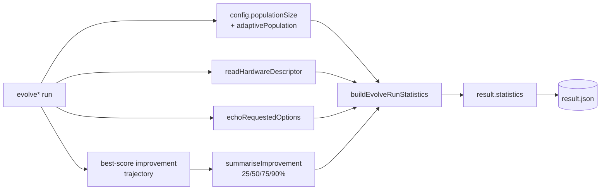

# Record population size and options in evolve statistics (Issue #3422)

## Summary

Every `evolve*` result (`evolveDir`, `evolveDataSet`, `evolveEnv`, `evolveRL`)
now carries a run-level `statistics` block so GRQ-cluster's `result.json` is
self-contained enough to compare configurations across the ~20-machine
production fleet and judge which gives the best **rate** of score improvement.
Final score alone is insufficient because runs plateau — the same final number
can be reached fast or slow, on a big or small machine. Judging "optimal"
happens downstream; this change only records the data. **Closes #3422.**

The new `statistics` block records:

- **`populationSize`** — the configured population size (the primary tuning
  variable), recorded even when it came from a default. When adaptive population
  sizing (`AdaptivePopulationConfig`) is enabled, **`finalPopulationSize`** adds
  the final actual population size and **`adaptivePopulation`** is `true`.
- **`hardware`** — best-effort host descriptors (`cpuCores`, `totalMemoryBytes`,
  `host`) for cross-machine normalisation. Each field is `null` when the runtime
  API is unavailable or `--allow-sys` was not granted — an explicit "unknown",
  not a fault masked as success.
- **`requestedOptions`** — a JSON-safe echo of the options the caller actually
  requested (changes from defaults; defaults are inferred downstream).
  Non-serialisable entries (callbacks such as `onTrainingEvent`, an
  `AbortSignal`, typed arrays) are recorded by a compact marker keyed by their
  option name, never serialised.
- **`improvement`** — a compact milestone summary of the score-improvement
  curve: the generation, elapsed time, and cumulative creatures scored at which
  the run reached 25/50/75/90% of its total improvement. Derived at run end from
  a tiny in-memory trajectory (one point per improvement); **no** per-generation
  series is persisted, so `result.json` stays small.

The existing throughput counters (`generation`, `scorerUtilisation`, `time`) are
unchanged; per-hour rates are derived downstream, not emitted.

### Design

Four focused modules under `src/creature/` keep each concern testable in
isolation, assembled by a single builder:

- `EvolveImprovementMilestones.ts` — trajectory tracker +
  `summariseImprovement`.
- `EvolveHardware.ts` — `readHardwareDescriptor` (best-effort, never throws).
- `EvolveOptionsEcho.ts` — `echoRequestedOptions` (JSON-safe, circular-safe).
- `EvolveRunStatistics.ts` — `buildEvolveRunStatistics` assembler + the
  `EvolveRunStatistics` type.

`evolveDataSet` forwards the fully-resolved config to `evolveDir`, so it
overrides `requestedOptions` with an echo of **its own** caller options to keep
the "changes from defaults" contract. New public type exports from `mod.ts`:
`EvolveRunStatistics`, `HardwareDescriptor`, `OptionsEcho`,
`ImprovementSummary`, `ImprovementMilestone`.

## Evidence

Backend/library change — no web interface to screenshot. Verified with unit and
integration tests (below) plus the project quality gates:

- `deno fmt --check` — clean (2173 files).
- `deno lint` (full) and `./quality.sh --lint-only` — clean (rc=0).
- `./quality.sh --check-only` (project-wide `deno check`) — no type errors.
- Targeted suites: `test/creature/` (61 passed), plus
  `test/config/TrainingEvent.ts`, `test/config/ThroughputMetrics.ts`,
  `test/costs/CostAwareEarlyStopIntegration.ts`,
  `test/wasm/WasmEvolveDirCoverage.ts` (33 passed) — all green.

The change is purely additive to the result shape; no existing test asserts an
exact result shape, and the whole project type-checks with the new field.

## Test Plan

New unit tests (call the real functions and assert on outcomes):

- `test/creature/EvolveImprovementMilestones.ts` — empty/single/linear/negative
  trajectories, 25/50/75/90% bucketing, monotonic-guard on non-improving points.
- `test/creature/EvolveHardware.ts` — descriptor types are JSON-safe and
  correctly typed (number/string or `null`).
- `test/creature/EvolveOptionsEcho.ts` — primitives passed through; functions
  and non-plain objects recorded by marker; non-finite numbers stringified;
  circular references survive; `null`/`undefined` input.
- `test/creature/EvolveRunStatistics.ts` — builder assembly,
  `finalPopulationSize` gated on adaptive sizing, whole block JSON-serialisable.

New integration test:

- `test/creature/EvolveRunStatistics_integration.ts` — a real `evolveDataSet`
  XOR run returns `statistics` with the configured population size, hardware
  block, options echo (callback recorded by marker), and an improvement summary
  whose `finalScore` matches `result.score`; the block round-trips through
  `JSON.stringify`.
