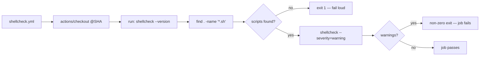

## Summary

Migrated the `ShellCheck` CI gate off the unmaintained
`ludeeus/action-shellcheck` wrapper (no release in ~42 months, no commit in
~25). Rather than swap in another third-party wrapper, the workflow now lints
with the `koalaman/shellcheck` binary **preinstalled on the `ubuntu-latest`
runner**, invoked directly from a `run:` step — removing the orphaned Action
from the supply chain entirely. Closes #3426.

Behaviour is preserved one-for-one: the previous `scandir: .` +
`severity: warning` inputs map to a repo-wide `find` for `*.sh` scripts piped
through `shellcheck --severity=warning`. The step **fails loud** (Issue #3234) —
a non-zero `shellcheck` exit fails the job, and finding zero scripts (a broken
glob) also exits non-zero rather than reporting a false-clean pass.

### Why direct-run instead of `reviewdog/action-shellcheck`

`reviewdog/action-shellcheck` defaults to `filter_mode: added`, which lints only
changed lines and would **silently** let pre-existing shell-script warnings
through — a regression of the gate's coverage and a silent-failure risk. Running
the preinstalled binary keeps full-repo coverage with no external Action to vet,
pin, or maintain.

## Evidence

Backend/CI change — no web interface to screenshot. Verified via the CI tests
below and by running the real `shellcheck` binary over every repo shell script.

- `test/scripts/ShellCheckLint.ts::all shell scripts pass shellcheck --severity=warning`
  runs the real binary over every `*.sh` script — passes.
- `deno test test/ci/ShellcheckWorkflowPinning.ts test/scripts/ShellCheckLint.ts
  test/ci/WorkflowActionPinning.ts`
  — 16 passed, 0 failed.
- `./quality.sh --lint-only` — fmt, lint, and bash checks all pass.

## Test Plan

Tests were updated (TDD: written to fail against the old workflow first) to
assert the new behaviour. Business-logic change documented here: the premise
that `ludeeus/action-shellcheck` must be SHA-pinned is obsolete now the wrapper
is gone, so the ludeeus-specific pinning assertions were repurposed — no tests
were removed or commented out.

- `test/ci/ShellcheckWorkflowPinning.ts`
  - Kept the generic `extractUses` parser unit tests.
  - New:
    `shellcheck.yml no longer uses the unmaintained ludeeus/action-shellcheck (Issue #3426)`.
  - New:
    `shellcheck.yml lints via the preinstalled koalaman/shellcheck binary (Issue #3426)`.
  - Retained SHA-pinning coverage for every remaining `uses:` (e.g.
    `actions/checkout`).
- `test/scripts/ShellCheckLint.ts`
  - Updated the workflow-shape assertions: must **not** reference the
    unmaintained wrapper, must run `shellcheck --severity=warning` directly,
    still triggers on `pull_request` and references upstream
    `koalaman/shellcheck`.
  - The existing "all shell scripts pass" behaviour test is unchanged and still
    green.
- `test/ci/WorkflowActionPinning.ts` (generic, unchanged) continues to enforce
  40-char SHA pinning across all workflows.
