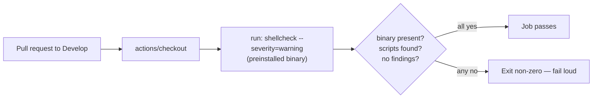

## Summary

The `shellcheck` CI job wrapped `koalaman/shellcheck` through the third-party
`ludeeus/action-shellcheck` action, which is **unmaintained** — no release since
2023-01, no commit since 2024-06, and a growing unanswered issue/PR backlog
(ORPHAN-STALE). Because the action was SHA-pinned to a dormant repository, no
fix would ever arrive through the normal bump flow.

This PR removes the orphaned dependency **at the root** rather than swapping it
for another wrapper: the job now invokes the `shellcheck` binary preinstalled on
`ubuntu-latest` runners directly via a `run:` step. There is no dormant SHA to
track, and the job follows the actively-maintained runner image's shellcheck
version.

Behaviour is preserved:

- **File discovery** mirrors `quality.sh` (`find . -name '*.sh'`), covering the
  same six shell scripts the wrapper linted (all repo scripts use the `.sh`
  extension; no extensionless shebang scripts exist).
- **`severity=warning`** matches the previous wrapper configuration exactly —
  info-level findings (e.g. SC2086) are filtered, warning-and-above fail the
  job.
- **Fails loud** (Issue #3234): the step exits non-zero if the binary is
  missing, no scripts are found, or shellcheck reports a finding — a fault is
  never masked as success.
- **bash 3.2 compatible**: a null-delimited `read` loop is used instead of the
  bash-4-only `mapfile`.

Closes #3426.

## Evidence

Backend/CI change only — no web interface to screenshot. Validated with the same
tools CI uses:

- `actionlint` (all workflows, incl. embedded `run:` shellcheck lint): **pass**
- `shellcheck --severity=warning` over the six repo scripts: **exit 0** (parity
  with current CI)
- Fail-loud paths verified: empty file set → exit 1; a warning-level finding
  (SC2164) → exit 1; info-level finding (SC2086) correctly filtered by
  `severity=warning` → exit 0
- Step logic re-run end-to-end under local bash 3.2.57 → **exit 0**

## Test Plan

There is no application function to unit-test — the change is to a CI workflow.
Verification used the workflow's own gate tools:

- `actionlint .github/workflows/shellcheck.yml` and `actionlint` (all workflows)
- `shellcheck --severity=warning` over the discovered `*.sh` set (exit 0)
- Simulated the exact `run:` step under bash 3.2 (success path, empty-set
  failure path, and finding failure path)

### Existing CI-guard tests updated (documented per TDD policy)

Two existing tests asserted the now-removed `ludeeus/action-shellcheck`
dependency and were updated to match the migrated workflow (business-logic
change — not deleted):

- `test/ci/ShellcheckWorkflowPinning.ts` — the ludeeus-specific SHA-pin test is
  generalised to pin **every** remaining `uses:` action to a 40-char SHA, and a
  new test asserts the orphaned wrapper is gone and
  `shellcheck --severity=warning` is invoked directly.
- `test/scripts/ShellCheckLint.ts` — the "well-formed workflow" test now asserts
  the wrapper is absent and shellcheck runs directly; the "all shell scripts
  pass `shellcheck --severity=warning`" behavioural test is unchanged.

`test/ci/WorkflowActionPinning.ts` (generic pin guard) required no change and
still passes. All 14 tests across these files pass.
