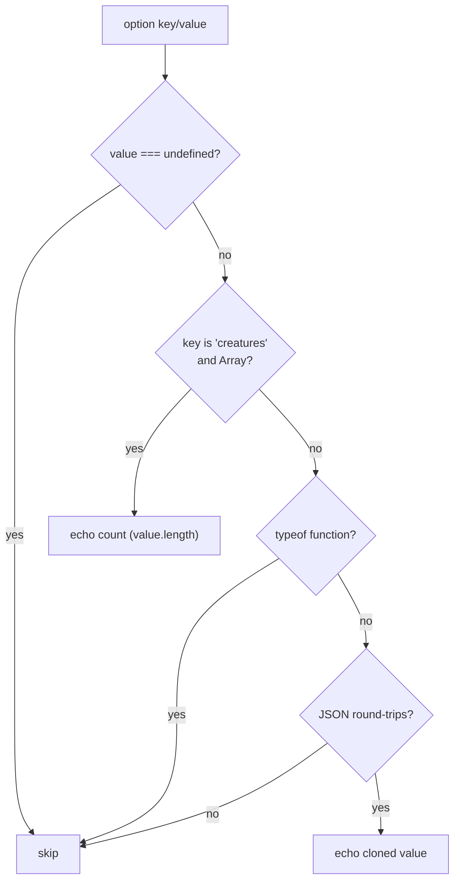

## Summary

The `requestedOptions` echo added by #3422 (`serialiseOptionsEcho` in
`src/creature/EvolveOptionsEcho.ts`) recorded every caller-supplied option,
replacing values that cannot round-trip through JSON with a `"[function]"` /
`"[unserialisable]"` marker. Those marker entries — notably `creatures` (the
seed-creature array), which landed as `"[unserialisable]"` in every GRQ-cluster
snapshot — are pure noise with no tuning value.

This change drops **every** marker-valued entry from the echo: any option whose
value cannot serialise (functions, callbacks, non-JSON values) is now omitted
entirely — no marker remains. The one exception is `creatures`: instead of
dropping the seed array it is echoed as its **count** (a number, e.g.
`"creatures": 12`), since seed size can matter when comparing runs. An empty
seed array echoes as `0`; when the caller supplies no `creatures` option at all,
nothing is echoed. Serialisable options (e.g. `creatureStore`) are unaffected.

The now-unused `OPTION_FUNCTION_MARKER` / `OPTION_UNSERIALISABLE_MARKER` exports
are removed. Historic snapshot files already committed in GRQ-cluster are not
rewritten; the new field shape applies to future runs once GRQ picks up a
NEAT-AI release containing this fix (release is human-gated, out of scope here).

Closes #3427.

## Evidence

Backend/library change with no web interface to screenshot. Verified via unit
and integration tests (all passing) — see the Test Plan below.

## Test Plan

`test/creature/EvolveOptionsEcho.ts` (updated):

- `drops function options entirely` — function/callback options are omitted, not
  marked.
- `drops non-serialisable (circular) values` — circular values are omitted, not
  marked.
- `echoes the creatures seed array as its count` — `creatures: [...]` → count.
- `echoes an empty creatures array as 0`.
- `omits creatures when the caller supplies none`.
- Retained: serialisable echo, undefined skipping, empty-input, deep-clone.

`test/creature/EvolveRunStatistics_integration.ts` (updated):

- `evolveDataSet returns run-level tuning statistics` now asserts the
  `onTrainingEvent` callback is dropped from `requestedOptions` (not echoed as a
  marker) and never appears in the serialised result JSON.
