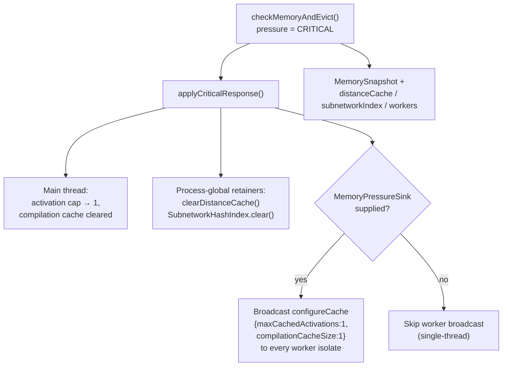

# MemoryMonitor: evict worker WASM caches + DistanceCache + SubnetworkHashIndex under pressure

## Summary

Under heap pressure the `MemoryMonitor` only evicted the **main-thread** WASM
activation LRU and compilation cache. Worker isolates kept their own WASM heaps,
and the process-global breed `DistanceCache` and shared discovery
`SubnetworkHashIndex` were never evicted — so RSS could keep climbing while the
main isolate reported that the caches were not the retainer.

This change extends the graduated pressure responses to reach those retainers
(Issue #3431):

- **WARNING and CRITICAL** now broadcast the same reduced WASM cache caps the
  main thread applied to every live worker isolate via
  `WorkerHandler.configureCache` (Issue #1567), through a new
  `MemoryPressureSink` supplied by the evolution loop.
- **CRITICAL** additionally clears the process-global breed `DistanceCache` and
  the shared discovery `SubnetworkHashIndex`.
- The diagnostic `MemorySnapshot` gained `distanceCacheEntries`,
  `distanceCacheMax`, `subnetworkIndexEntries`, and `workerCount` fields, all
  surfaced on the snapshot log line so #2381-style backoff can see the real
  retainer.
- No behaviour change when `memory.enabled` is `false` — every new action runs
  inside the existing `config.enabled` gate, and the sink is optional so
  single-thread contexts are unaffected.

Failure handling is loud, not silent: a throwing sink is caught and logged with
context (`Failed to broadcast reduced cache caps to workers: …`) rather than
swallowed, and a dead/rejecting worker promise cannot crash the monitor or leak
an unhandled rejection.

Closes #3431.

## Evidence

Backend/CLI change with no web interface — no screenshot applicable. Verified by
unit tests (below) plus `./quality.sh`.

Data flow of a CRITICAL response after this change:



## Test Plan

New/updated tests (all "what" tests — they drive real functions and assert on
observable state):

`test/NEAT/MemoryMonitor.ts`

- `applyCriticalResponse broadcasts minimum caps to worker isolates (#3431)`
- `applyWarningResponse broadcasts the halved activation cap to workers (#3431)`
- `applyCriticalResponse clears the DistanceCache and SubnetworkHashIndex (#3431)`
- `checkMemoryAndEvict clears retainers and broadcasts to workers on critical (#3431)`
- `checkMemoryAndEvict does not touch retainers or workers when disabled (#3431)`
- `captureMemorySnapshot records retainer sizes and worker count (#3431)`
- `captureMemorySnapshot defaults worker count to zero without a sink (#3431)`
- `broadcastWorkerCacheCaps swallows a throwing sink (#3431)`
- Updated `formatMemorySnapshot` test to assert the new `distanceCache=`,
  `subnetworkIndex=`, and `workers=` fields.

`test/NEAT/createMemoryPressureSink.ts` (new)

- Broadcasts caps to every worker; reports live worker count; no-op for an empty
  pool; continues past a throwing worker; swallows a rejected worker promise.

Run:

```bash
deno test --allow-all test/NEAT/MemoryMonitor.ts test/NEAT/createMemoryPressureSink.ts < /dev/null
# ok | 53 passed | 0 failed
```
