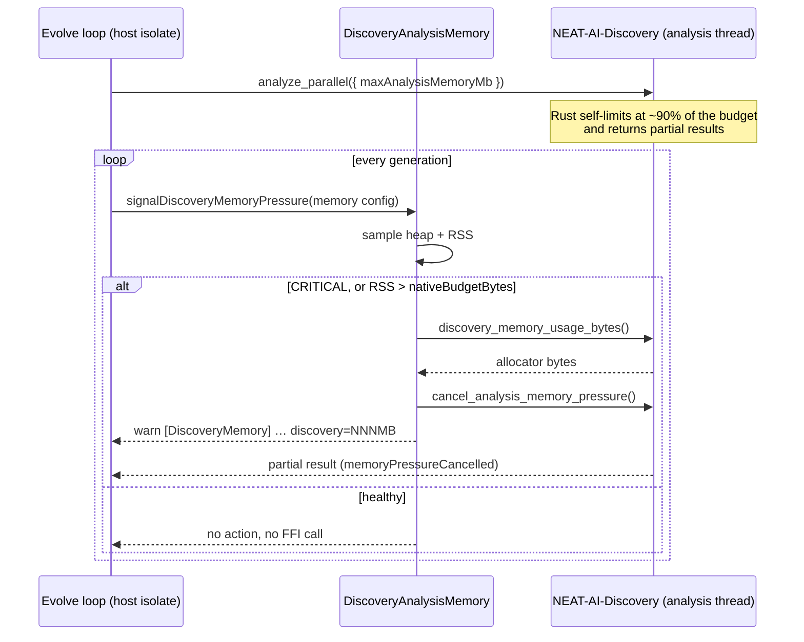

# Wire Discovery analysis memory FFI into the `evolveDir` path

## Summary

NEAT-AI-Discovery has shipped three analysis-memory controls for some time, and
NEAT-AI used **none** of them on the parallel-analysis path. The practical
consequence is the one named in the issue: Rust ran with **no host-provided
analysis memory budget**, so nothing bounded the Discovery allocator during a
discovery-heavy `evolveDir` run. This PR plumbs all three through. Closes #3432.

| Discovery API                             | Before     | After                                                    |
| ----------------------------------------- | ---------- | -------------------------------------------------------- |
| `maxAnalysisMemoryMb` (Discovery #1028)   | never sent | sent on every `analyze_parallel` when configured         |
| `discovery_memory_usage_bytes` (#1027)    | not loaded | loaded; surfaced in analysis + pressure diagnostics      |
| `cancel_analysis_memory_pressure` (#1099) | not loaded | called on host CRITICAL / `nativeBudgetBytes` RSS breach |

Why the budget matters more than a host-side guard: `analyze_parallel` is a
**blocking** FFI call. While Rust is analysing, the calling isolate cannot run a
timer, sample the heap, or evict a cache — so `AnalysisHeapGuard` and
`MemoryMonitor` are structurally unable to see or stop the analysis footprint.
The budget is the only in-flight brake, and cancellation only works because
Discovery's cancellation flag is process-wide: the evolve loop signals it from
the host isolate while the analysis blocks a different thread.

### What changed

- **`memory.maxAnalysisMemoryMb`** (new, default `0`) flows
  `NeatConfig → DataRecorder → DiscoverStructure → RustParallelAnalysisInput`.
  `0`/unset keeps the field **off the wire** — Discovery reads an absent field
  as "unbounded", so `0` and "omitted" are not interchangeable (a literal `0`
  would starve the analysis immediately).
- **`DiscoveryAnalysisMemory.ts`** (new) holds the pure budget resolution, the
  cancellation decision, the diagnostic formatter, and the signal helper, with
  the FFI behind an injectable seam.
- **Separate `dlopen` handle** for the two memory symbols. `dlopen` fails the
  whole call when any requested symbol is missing, so folding them into the core
  symbol set would have made an older Discovery build disable discovery
  entirely. A missing surface now emits a one-time warning and reports
  `cancelled: false` — never a silent or falsely-successful cancellation.
- **Cancellation rule** reuses the existing #3025 heap-guard logic, so a
  worker-V8-only CRITICAL with off-heap headroom still does **not** cancel a
  healthy analysis. An RSS breach of `nativeBudgetBytes` cancels even when the
  V8 fraction looks fine — that is precisely the growth the host cannot
  otherwise see.
- **Passive vs active FFI reads:** `getDiscoveryMemoryUsageBytes()` never loads
  the library (diagnostics must not open an FFI handle as a side effect);
  `cancelAnalysisMemoryPressure()` does, since it only runs under genuine
  pressure and must be able to reach a worker's analysis at all.

## Evidence

Backend/CLI change — there is no web interface to screenshot. Verification is by
test (below) plus the full quality gate.

`./quality.sh` passes end to end: **7787 passed, 0 failed, 4 ignored** (lint,
fmt, bash syntax, `deno check`, discovery library build, WASM sync, full suite).

### Acceptance criteria

| Criterion                                                  | Covered by                                                              |
| ---------------------------------------------------------- | ----------------------------------------------------------------------- |
| Parallel analysis requests include a configured budget     | `AnalysisMemoryBudgetWiring.ts` — asserts on the captured Rust payload  |
| Host can observe Discovery-reported usage bytes            | `DiscoveryAnalysisMemory.ts` — asserts `discovery=512MB` in the warning |
| CRITICAL / native-budget breach cancels in-flight analysis | `DiscoveryAnalysisMemory.ts` — cancel spy called; loop continues        |
| Tests cover the wiring with mocked FFI (no real GPU)       | Both files inject fakes; neither needs a built library or a GPU         |

## Test Plan

New — `test/ErrorGuidedStructuralEvolution/DiscoveryAnalysisMemory.ts` (16
tests):

- `resolveAnalysisMemoryBudgetMb` — unset / `0` / negative / non-finite all
  resolve to "omit"; a positive budget is floored.
- `shouldCancelAnalysisForMemoryPressure` — monitoring disabled never cancels;
  host CRITICAL cancels; an RSS breach cancels with a healthy V8 fraction; a
  V8-only CRITICAL with off-heap headroom does not; a healthy sample does not.
- `formatDiscoveryMemoryUsage` — megabytes, and `unavailable` (never `0`) for a
  missing reading.
- `signalDiscoveryMemoryPressure` — healthy heap touches no FFI at all; CRITICAL
  cancels and logs the Discovery usage bytes; a native-budget breach cancels; an
  unavailable FFI surface reports `cancelled: false` with an explicit warning
  rather than a false success.

New — `test/ErrorGuidedStructuralEvolution/AnalysisMemoryBudgetWiring.ts` (6
tests), all asserting on the payload actually handed to Rust:

- Configured budget appears as `maxAnalysisMemoryMb`; a fractional budget is
  floored.
- Unconfigured and `0` budgets leave the key **absent** from the payload.
- `DiscoverStructure` constructed with the option forwards it end to end.
- `memory.maxAnalysisMemoryMb` defaults to `0` and round-trips through
  `createNeatConfig`.

No existing tests were modified or removed.
