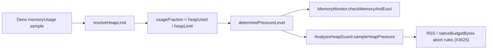

# Align AnalysisHeapGuard with the MemoryMonitor heap_size_limit denominator

## Summary

Issue #3410 fixed `MemoryMonitor` to measure heap pressure against the real V8
`heap_size_limit` (the OOM ceiling resolved via `resolveHeapLimit`), not the
dynamically-committed `heapTotal`. Discovery's
`AnalysisHeapGuard.sampleHeapPressure` was still computing its usage fraction as
`heapUsed / heapTotal`, so its degrade/abort decisions could disagree with
`MemoryMonitor` on the same `Deno.memoryUsage()` / V8 sample — firing CRITICAL
against a tiny committed heap while gigabytes of headroom remained.

`sampleHeapPressure` now resolves the denominator through the same shared
`resolveHeapLimit` helper `MemoryMonitor` uses, so the two agree on the pressure
level for any given sample. The off-heap RSS / `nativeBudgetBytes` abort rules
(Issue #3025) are unchanged and still apply on top of the corrected V8 fraction.
`HeapGuardSample` gains a `heapLimit` field mirroring the resolved denominator.

Closes #3433.

## Change flow

Both `MemoryMonitor` and the Discovery heap guard now flow through the same
`resolveHeapLimit` denominator, so they classify pressure identically.

## Evidence

Backend/CLI change — no web interface to screenshot. Verified via unit tests
(`deno test`), `deno fmt --check`, `deno lint`, and `deno check`.

Old formula (`heapUsed / heapTotal`): 231 MB / 269 MB ≈ 0.86 → CRITICAL. New
formula (`heapUsed / heapLimit`): 231 MB / 4373 MB ≈ 0.05 → normal. The
regression test below fails on the old formula and passes on the shared helper.

## Test Plan

Added to `test/ErrorGuidedStructuralEvolution/AnalysisHeapGuard.ts`:

- `sampleHeapPressure: small committed heapTotal + large heapLimit is NOT
  critical (#3433)`
  — the #3410 regression mirror; CRITICAL under the old formula, normal under
  the shared denominator.
- `sampleHeapPressure: divides heapUsed by heapLimit not heapTotal (#3433)`.
- `sampleHeapPressure: critical when heapUsed near heapLimit (#3433)`.
- `sampleHeapPressure: falls back to heapTotal when heapLimit unreported
  (#3433)`
  — preserves legacy behaviour when the runtime cannot report the limit.
- `isHeapCritical: large heapLimit keeps a small committed heap non-critical
  (#3433)`.

Updated existing `HeapGuardSample` literals in the same file and in
`test/ErrorGuidedStructuralEvolution/DiscoveryAnalysisMemory.ts` to include the
new `heapLimit` field. All existing #3025 / #2594 guard tests still pass
unchanged (27 tests in `AnalysisHeapGuard.ts`), and the #3410 `MemoryMonitor`
tests remain green.

## Docs

`docs/troubleshooting/MEMORY.md` now notes that the Discovery analysis-extension
guard shares the `resolveHeapLimit` denominator with `MemoryMonitor`.
