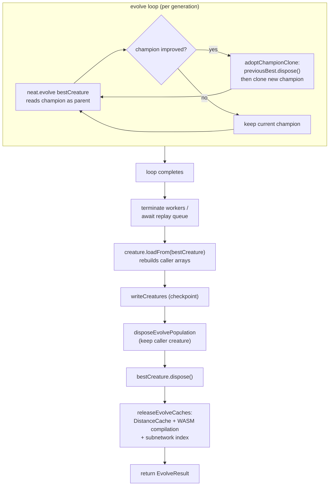

# evolveDir: dispose replaced champion clones and release population/caches on teardown

## Summary

`evolveDir` (and its siblings `evolveEnv` / `evolveRL`) leaked at the **run**
level: each champion improvement overwrote `bestCreature` with a fresh
`shallowClone()` and left the superseded clone reachable until GC, and after the
run neither the population members nor the final champion clone were disposed
and the process-global breed/discovery caches were left populated. Repeated
`evolve*` calls in one process therefore accumulated sticky WASM compilation
templates and breed/discovery indexes and pinned RSS high. Per-generation
dropout dispose (#1568) already runs inside `NeatEvolution`; this closes the
run-level gap. **Closes #3434.**

The fix adds a small shared teardown module,
[`src/creature/EvolveTeardown.ts`](../../../src/creature/EvolveTeardown.ts),
wired into all three entry points (`evolveDataSet` is covered transitively — it
delegates to `evolveDir`):

1. **Dispose-on-replace** — `adoptChampionClone(previousBest, fittest, score)`
   disposes the superseded champion before cloning the new one. This is safe
   because the evolve loop passes the current champion into `neat.evolve()` as a
   read-only parent _before_ the replace, and `neat.evolve()` clones (never
   retains) it — so the old champion is dead once the call returns.
2. **Population dispose on exit** —
   `disposeEvolvePopulation(neat.population,
   creature)` disposes every
   population member from the run except the caller creature (member 0 of the
   population). The champion is restored into the caller via `loadFrom`, which
   rebuilds the caller's own arrays, so the caller stays valid. The temporary
   `bestCreature` clone is disposed after `loadFrom`.
3. **Cache release on exit** — `releaseEvolveCaches()` clears the process-global
   `DistanceCache`, the WASM compilation cache, and the shared subnetwork hash
   index, so a second `evolve*` in the same process starts from a clean
   baseline.

## Evidence

This is a backend/lifecycle change — no web interface to screenshot. Verified
via unit tests plus the existing evolve integration suites.

### Run-level teardown flow

### Test results

- New unit tests: `deno test test/creature/EvolveTeardown.ts` → **7 passed**.
- evolveDir integration: `test/creature/CreatureTrainEvolve.ts` → 19 passed.
- evolveEnv / evolveRL: `test/creature/EvolveEnv.ts`,
  `test/creature/evolveRL_test.ts`,
  `test/creature/evolveRL_heapStability_test.ts` → 24 passed.
- `deno fmt` / `deno lint` clean on all changed files.

> One pre-existing, unrelated failure remains in
> `test/ErrorGuidedStructuralEvolution/DiscoveryHeapAbortBoundaryIntegration.ts`
> (it asserts the machine's **live** V8 heap fraction is critical; it fails on a
> clean baseline of this branch too, with none of this issue's files loaded). It
> stems from the recent #3433 heap-guard alignment, not from this change, and is
> out of scope here.

## Test Plan

Added `test/creature/EvolveTeardown.ts` — pure "what" tests, no timing APIs:

- `adoptChampionClone` disposes the previous champion, returns a fresh,
  independent clone with the new score, and leaves the source `fittest` intact.
- `adoptChampionClone` with no previous champion (first win) just returns the
  clone.
- `disposeEvolvePopulation` disposes every member except the caller creature and
  returns the disposed count (including the caller-at-index-0 case).
- `releaseEvolveCaches` clears a seeded `DistanceCache` entry, the shared
  subnetwork index, and a seeded WASM compilation template (probed by unique
  keys so the assertions are robust under the parallel test runner).
