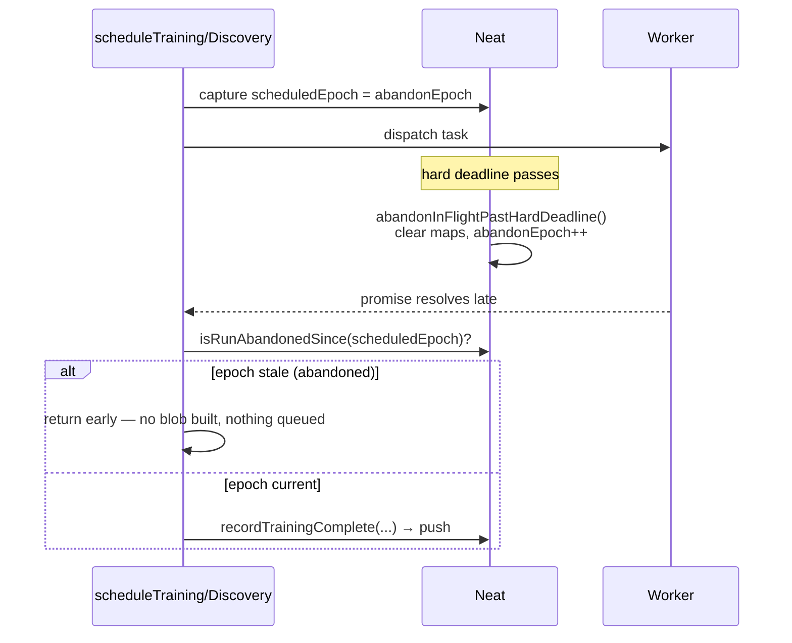
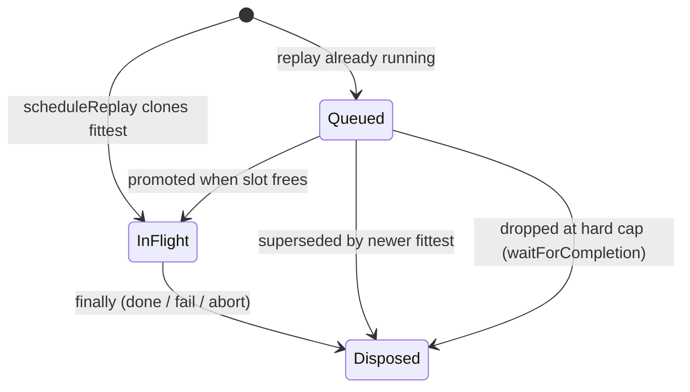

# Discard late completions after abandon; release replay clones promptly

## Summary

Long-running discovery/training/replay work kept strong references to live
`Creature` payloads for the whole async lifetime, and a hard-deadline abandon
cleared the in-progress Maps but did **not** stop late-resolving worker promises
from pushing full result blobs back into `discoveryComplete` /
`trainingComplete` — re-inflating the heap right after the run had deliberately
shed the work. Replay clones were likewise retained across generations.

This change:

1. **Discards late completions after a hard-deadline abandon.**
   `Neat.abandonInFlightPastHardDeadline()` now bumps a monotonic `abandonEpoch`
   token. Each scheduled discovery/training task captures the token at schedule
   time; the completion handlers guard on it (`isRunAbandonedSince`) and route
   pushes through new `recordDiscoveryComplete` / `recordTrainingComplete`
   helpers that discard — without mutating the maps — when the run was abandoned
   or the task is no longer tracked. The guard runs **before** any heavy work
   (building the improved creature, rebuilding the trained creature,
   fine-tuning, trace writing, or serialising the failed creature), so no large
   result blob is built or queued after abandon.

2. **Releases replay clones promptly.** `DiscoveryReplayQueue` now disposes each
   replay clone in the `.finally` (on completion, failure, or abort), disposes a
   superseded queued clone when a newer fittest overwrites it, and disposes the
   queued clone dropped when `waitForCompletion` stops at the hard cap.

Closes #3435.

## Evidence

Backend/library change — no UI. Verified via new unit tests (below) and the
existing discovery-replay / hard-deadline suites (all green).

### Abandon → late-resolve flow

### Replay clone lifecycle

## Test Plan

New tests (behavioural only — no timing assertions, per #2888):

- `test/NEAT/NeatAbandonLateCompletion.ts`
  - `recordDiscoveryComplete` / `recordTrainingComplete` record a live task's
    result and release the in-progress bookkeeping.
  - Both discard a late completion after `abandonInFlightPastHardDeadline`
    (nothing re-inflates the complete queues).
  - Both discard when the task is no longer tracked (per-task abandon).
  - `abandonInFlightPastHardDeadline` bumps the token so prior tasks read as
    abandoned while post-abandon tasks are honoured; a below-cap call leaves the
    token untouched.
- `test/NEAT/DiscoveryReplayQueueDisposal.ts`
  - Replay clone is disposed on completion and on failure (caller's creature
    untouched).
  - A superseded queued clone is dropped without a third replay; every started
    clone ends disposed.
  - The queued clone dropped at the hard cap does not start.

Regression coverage: existing `NeatHardDeadlineEnforcement`,
`DiscoveryReplayQueue*`, `NeatFinishUp`, `TrainingRegressionSkip`, and
`PoolBorrowing` suites all pass unchanged.

## Deno regression avoided

Implemented entirely with Deno-native tooling (`deno test`, `deno lint`,
`deno fmt`, `deno check`) — no Node tooling or dependencies introduced.
