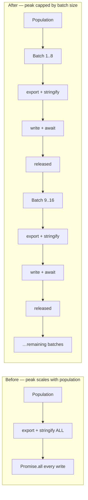

## Summary

Per-generation checkpoints used to export and serialise **every** population
member up front and then `Promise.all` the writes, so the transient checkpoint
footprint scaled as `populationSize × genome JSON` on top of an already-hot
generation — exactly the pressure seen with `checkpointEveryGeneration` and
large adaptive populations (#3430). `writeCreatures` now writes in **bounded
batches of 8**: each batch is exported, stringified, written, and awaited before
the next batch allocates anything. Closes #3436.

The write path moved out of the 1700-line `CreatureTraining.ts` into a small
focused module, `src/creature/CheckpointWriter.ts`, so it is directly testable.
File contents, file numbering, semanticVersion healing (#2349) and warm-up tag
stamping (#2909) are unchanged.



## Evidence

Backend/CLI change — no web interface to screenshot.

### Benchmark: `bench/CheckpointWritePeakHeap.ts`

One fresh `deno run` subprocess per (mode, scenario) so each measurement starts
from an empty heap; children run with `--v8-flags=--expose-gc` so samples
measure the **live** set rather than uncollected garbage; median of 3 runs.
`promise-all` replicates the pre-#3436 code verbatim, `batched` calls the
shipped `writeCreatures`. Creatures are 20→5 with two hidden layers of 80 (~1 MB
of JSON each).

| Population | peak RSS before | peak RSS after | Saved            |
| ---------- | --------------- | -------------- | ---------------- |
| 16         | 252.2 MB        | 247.7 MB       | 4.5 MB (1.8%)    |
| 54         | 475.9 MB        | 432.7 MB       | 43.2 MB (9.1%)   |
| 128        | 917.0 MB        | 812.3 MB       | 104.7 MB (11.4%) |
| 256        | 1575.0 MB       | 1359.1 MB      | 215.9 MB (13.7%) |

Bytes written are identical between modes (differences in the table's raw output
come only from each subprocess building its own random population).

The saving grows linearly with population — that is the point: the transient
checkpoint cost is now capped by the batch size instead of the population size.

`peak heapUsed` is unchanged (≈0.0%) at every size, and that is the expected,
honest result: `Deno.writeTextFile` encodes the string to bytes at call time, so
the accumulation the old code caused was in **native** in-flight write buffers
(visible in RSS), not in V8 heap strings. The V8-side bound — at most
`batchSize` genome JSON strings alive at once — is verified directly by the unit
tests rather than by sampling.

Reproduce:

```bash
deno run --allow-all bench/CheckpointWritePeakHeap.ts
```

### Quality gate

`./quality.sh` passes: `7834 passed | 0 failed | 4 ignored`.

## Test Plan

New behavioural tests in `test/creature/CheckpointWriteBatching.ts` (11 tests,
all calling the real `writeCreatures`):

- `caps concurrent checkpoint writes at the batch size` — an injected write seam
  records overlapping writes; peak in-flight is exactly the requested batch size
  (fails against the pre-#3436 `Promise.all` implementation, where peak equals
  the population size).
- `peak concurrency is independent of population size` — populations of 12 and
  120 produce the same peak in-flight count, bounded by
  `DEFAULT_CHECKPOINT_WRITE_BATCH_SIZE`.
- `produces the same files regardless of batch size` — `batchSize: 1` and
  `batchSize: 64` write byte-identical files.
- `numbers files 1..N in population order` — checkpoint `i+1.json` holds
  population member `i`.
- `empties stale checkpoint files first` and
  `with an empty population writes
  nothing`.
- `heals an invalid semanticVersion before writing (#2349)`.
- `stamps warm-up tags on every batch while warming (#2909)` and
  `strips warm-up tags once warm (#2909)` — verified across batch boundaries.
- `rejects an invalid batch size loudly` (RangeError for 0, -1, 1.5, NaN) and
  `propagates a write failure instead of swallowing it` — no silent failure.

Existing coverage kept green and unmodified: `test/NEAT/AsyncDiskIO.ts`,
`test/creature/SemanticVersionWriteGuard.ts`,
`test/config/CheckpointEveryGeneration.ts`,
`test/config/CheckpointWriteTiming.ts`, `test/NEAT/SeedWarmupAccumulation.ts`.

## Security self-check

- No new external input surface: `writeCreatures` takes an in-process population
  and a caller-supplied directory, as before.
- `batchSize` is validated (positive integer) and fails loud with `RangeError`.
- Write failures reject rather than being swallowed.
- No new dependencies, no secrets, no shell/SQL/HTTP surface.
