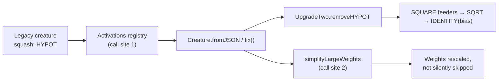

# Retain deprecated `HYPOT` call sites deliberately (#3446)

## Summary

Issue #3446 flagged four `HYPOT` references in production code (`Activations.ts`
import + registry entry, `SimplifyLargeWeights.ts` import + squash list) via the
TypeScript deprecation diagnostic, and offered two outcomes: remove them, or
keep them and mark them as deliberate.

Investigation showed **both call sites are load-bearing for backwards
compatibility**, so the second outcome applies — the same conclusion reached for
the sibling `HYPOTv2` (#3447) and `MEAN` (#3448) findings:

- **Registry** (`src/methods/activations/Activations.ts:236`) — a pre-v2.0.0
  serialised creature carrying `squash: "HYPOT"` must still deserialise and be
  repairable before `UpgradeTwo` rewrites it. Removing the registration makes
  `Activations.find` throw `ActivationError`. `mutationProbability` is `0`, so
  evolution never selects it.
- **Compaction** (`src/compact/SimplifyLargeWeights.ts:65`) — `HYPOT` is
  scale-homogeneous, so dropping it from the supported-squash list would
  silently skip weight rescaling for legacy creatures.

The stated replacement (`SQRT` & `SQUARE`) is already implemented as an
automatic migration in `src/upgrade/UpgradeTwo.ts::removeHYPOT` — it feeds each
inbound synapse through a `SQUARE` neuron, turns the `HYPOT` neuron into `SQRT`,
and moves the bias onto a following `IDENTITY` neuron. It is not a call-site
rewrite.

Changes: added `// best-practice-ignore: BP-91862f495db6` markers with the
rationale at all four call sites, added regression tests that fail if either
call site is removed, and corrected the `HYPOT` replacement column in
`docs/ACTIVATION_FUNCTIONS.md` (it said "Standard activation + bias"; the real
path is `SQRT` + `SQUARE`).

Closes #3446.

## Evidence

Backend-only change — no web interface to screenshot. Evidence is the red/green
behaviour of the new tests.

Both call sites were temporarily deleted to confirm the tests are load-bearing:

```text
# HYPOT removed from the registry and the squash list
FAILED | 0 passed | 2 failed (9ms)

# call sites restored
ok | 2 passed | 0 failed (46ms)
```

Full quality gate:

```text
./quality.sh
ok | 8315 passed (5 steps) | 0 failed | 4 ignored (3m18s)
```

Why each call site stays:



## Test Plan

- Added `test/deprecated/HYPOTBackwardsCompatibility.ts`:
  - `HYPOT: a serialised creature still deserialises, repairs and activates` —
    loads a creature with a `HYPOT` neuron, calls `fix()` (which resolves the
    squash through the registry) and asserts the activation equals
    `hypot(2, -6) + 0.5`. Throws `ActivationError` if the registration is
    dropped.
  - `HYPOT: simplifyLargeWeights rescales an imbalanced HYPOT neuron` — asserts
    `simplifyLargeWeights` reports a change and lowers the weight/bias penalty.
    Returns `false` if `HYPOT.NAME` leaves the supported-squash list.
- Existing coverage kept green: `test/upgrade/HYPOT.ts`,
  `test/compact/CompactCreatureSimplifyLargeWeightsSupportedSquashes.ts`,
  `test/methods/activations/unSquash.ts`.
