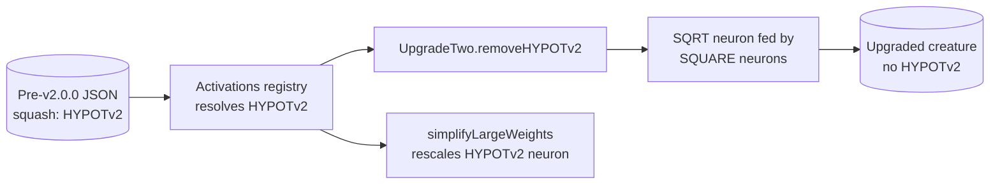

# Retain deprecated `HYPOTv2` call sites deliberately (#3447)

## Summary

Issue #3447 flagged four `HYPOTv2` references in production code
(`Activations.ts` import + registry entry, `SimplifyLargeWeights.ts` import +
squash list) via the TypeScript deprecation diagnostic, and offered two
outcomes: remove them, or keep them and mark them as deliberate.

Investigation showed **both call sites are load-bearing for backwards
compatibility**, so the second outcome applies:

- **Registry** (`src/methods/activations/Activations.ts:226`) — a pre-v2.0.0
  serialised creature carrying `squash: "HYPOTv2"` must still deserialise and be
  repairable before `UpgradeTwo` rewrites it. Removing the registration makes
  `Activations.find` throw `ActivationError` and breaks four existing tests
  (`test/wasm/DeprecatedSquashTypeCompat.ts` ×2, `test/upgrade/HYPOTv2.ts`,
  `test/optimize/activate/HYPOTv2.ts`). `mutationProbability` is `0`, so
  evolution never selects it.
- **Compaction** (`src/compact/SimplifyLargeWeights.ts:59`) — `HYPOTv2` is
  scale-homogeneous, so dropping it from the supported-squash list would
  silently skip weight rescaling for legacy creatures.

The stated replacement (`SQRT` & `SQUARE`) is already implemented as an
automatic migration in `src/upgrade/UpgradeTwo.ts::removeHYPOTv2` — it is not a
call-site rewrite.

Changes: added `// best-practice-ignore: BP-6b1e9a008759` markers with the
rationale at all four call sites, added regression tests that fail if either
call site is removed, and corrected the `HYPOTv2` replacement column in
`docs/ACTIVATION_FUNCTIONS.md` (it said "Standard activation + bias"; the real
path is `SQRT` + `SQUARE`).

Closes #3447.

## Evidence

Backend-only change — no web interface to screenshot. Evidence is the red/green
behaviour of the new tests.

`HYPOTv2` migration path, showing why the registry entry must survive long
enough for the upgrade to run:



**Red check** — with the registry entry deleted from `activationClasses`:

```text
HYPOTv2: a serialised creature still deserialises, repairs and activates ... FAILED
  ActivationError: Unknown activation: HYPOTv2
    at Creature.fix (src/Creature.ts:1137:14)
```

**Red check** — with `HYPOTv2.NAME` deleted from the `simplifyLargeWeights`
candidate set:

```text
HYPOTv2: simplifyLargeWeights rescales an imbalanced HYPOTv2 neuron ... FAILED
  AssertionError: HYPOTv2 is scale-homogeneous — expected a rescaling
```

**Green** — both call sites present, and the full gate:

```text
ok | 2 passed | 0 failed (31ms)
./quality.sh  →  ok | 8310 passed (5 steps) | 0 failed | 4 ignored (8m5s)
```

## Test Plan

Added `test/deprecated/HYPOTv2BackwardsCompatibility.ts`:

- `HYPOTv2: a serialised creature still deserialises, repairs and activates` —
  loads a creature with a `HYPOTv2` hidden neuron, calls `fix()` (which resolves
  the squash through the registry) and asserts the activation equals
  `Math.hypot(2.5, -5.5)`. Guards the `Activations.ts` call site.
- `HYPOTv2: simplifyLargeWeights rescales an imbalanced HYPOTv2 neuron` — calls
  `simplifyLargeWeights` directly on an export with a 1e6/1e-6 imbalance and
  asserts it rescales and reduces the weight/bias penalty. Guards the
  `SimplifyLargeWeights.ts` call site; existing coverage only reached this path
  indirectly through `compactCreature`.

No existing tests were modified or removed.
