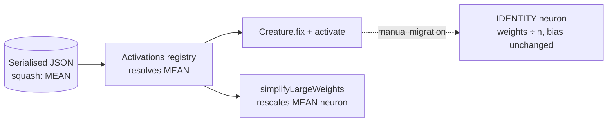

# Retain deprecated `MEAN` call sites deliberately (#3448)

## Summary

Issue #3448 flagged four `MEAN` references in production code (`Activations.ts`
import + registry entry, `SimplifyLargeWeights.ts` import + squash list) via the
TypeScript deprecation diagnostic, and offered two outcomes: remove them, or
keep them and mark them as deliberate. Unlike `HYPOT`/`HYPOTv2` the
`@deprecated` tag named no replacement, so that decision had to be made too.

Investigation showed **both call sites are load-bearing for backwards
compatibility**, so the second outcome applies:

- **Registry** (`src/methods/activations/Activations.ts:244`) — a serialised
  creature carrying `squash: "MEAN"` must still deserialise. Removing the
  registration makes `Activations.find` throw `ActivationError`. There is **no**
  `UpgradeTwo`-style rewrite for `MEAN` (`src/upgrade/UpgradeTwo.ts` handles
  only `HYPOT` and `HYPOTv2`), so unlike `HYPOTv2` the retention is permanent
  rather than transitional. `mutationProbability` is `0`, so evolution never
  selects it, and `src/wasm/SquashType.ts:112` still maps the name to
  `SquashType.Mean`.
- **Compaction** (`src/compact/SimplifyLargeWeights.ts:65`) — `MEAN` is
  scale-homogeneous, so dropping it from the supported-squash list would
  silently skip weight rescaling for creatures that carry it.

**Migration target decided**: a `MEAN` neuron computes `(Σ wᵢxᵢ) / n + b`, which
is exactly what an `IDENTITY` neuron with inbound weights `wᵢ/n` and the same
bias computes. The `@deprecated` tag on `src/deprecated/MEAN.ts` and the
deprecated-functions table in `docs/ACTIVATION_FUNCTIONS.md` now state that
replacement instead of the vague "a normal neural network can mimic the
behavior"; a new test pins the equivalence so the documented claim cannot rot.

Changes: added `// best-practice-ignore: BP-619a32c95d3a` markers with the
rationale at all four call sites, named the replacement in the tag and the docs,
and added regression tests that fail if either call site is removed.

Closes #3448.

## Evidence

Backend-only change — no web interface to screenshot. Evidence is the red/green
behaviour of the new tests.

Why each call site must survive, and what the manual migration looks like:



**Red check** — with the registry entry deleted from `activationClasses`:

```text
MEAN: a serialised creature still deserialises, repairs and activates ... FAILED
  ActivationError: Unknown activation: MEAN
    at Activations.find (src/methods/activations/Activations.ts:117:13)
    at Creature.fix (src/Creature.ts:1137:14)
```

**Red check** — with `MEAN.NAME` deleted from the `simplifyLargeWeights`
candidate set:

```text
MEAN: simplifyLargeWeights rescales an imbalanced MEAN neuron ... FAILED
  AssertionError: MEAN is scale-homogeneous — expected a rescaling
```

**Green** — both call sites present, and the full gate:

```text
ok | 3 passed | 0 failed (8ms)
./quality.sh  →  ok | 8313 passed (5 steps) | 0 failed | 4 ignored (4m22s)
```

## Test Plan

Added `test/deprecated/MEANBackwardsCompatibility.ts`:

- `MEAN: a serialised creature still deserialises, repairs and activates` —
  loads a creature with a `MEAN` hidden neuron, calls `fix()` (which resolves
  the squash through the registry) and asserts the activation equals
  `(1*2 + 2*-3) / 2 + 0.5`. Guards the `Activations.ts` call site.
- `MEAN: simplifyLargeWeights rescales an imbalanced MEAN neuron` — calls
  `simplifyLargeWeights` directly on an export with a 1e6/1e-6 imbalance and
  asserts it rescales and reduces the weight/bias penalty. Guards the
  `SimplifyLargeWeights.ts` call site; existing coverage only reached this path
  indirectly through `compactCreature`.
- `MEAN: an IDENTITY neuron with 1/n weights is an exact replacement` —
  activates a `MEAN` creature and its `IDENTITY`-with-`wᵢ/n` twin over five
  input samples and asserts they agree. Pins the migration target now stated in
  the `@deprecated` tag and `docs/ACTIVATION_FUNCTIONS.md`.

No existing tests were modified or removed.
