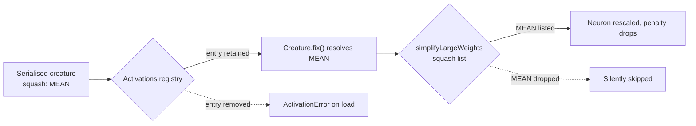

# Retain deprecated `MEAN` call sites deliberately (Issue #3448)

## Summary

`MEAN` (`src/deprecated/MEAN.ts`) is tagged `@deprecated` with no stated
replacement, yet has four production call sites across two files. Both call
sites turn out to be load-bearing, so they are retained deliberately, marked
with the finding's suppression marker, pinned by regression tests, and the
missing replacement is now documented. Closes #3448.

Why each site stays:

- **`src/methods/activations/Activations.ts`** — the registry is the single
  lookup point used by `Creature.fix()`. Dropping the `MEAN` entry makes any
  already-serialised creature carrying `MEAN` throw `ActivationError` on load.
  Committed CRISPR DNA fragments (`test/data/CRISPR/DNA-SANE.json`) also carry
  `MEAN`, and `src/wasm/SquashType.ts` still maps it to `SquashType.Mean`.
  Unlike `HYPOTv2` (Issue #3447) there is **no** automatic rewrite in
  `UpgradeTwo`, so the registration is the only thing keeping those creatures
  loadable.
- **`src/compact/SimplifyLargeWeights.ts`** — `MEAN` is scale-homogeneous, so
  removing it from the supported-squash list would silently skip compaction of
  those same creatures rather than fail loudly.

Both were marked `// best-practice-ignore: BP-619a32c95d3a`, matching the
pattern established for `HYPOTv2` in #3447.

The deprecation tag said only "a normal neural network can mimic the behavior of
this activation" without naming the replacement. It is now stated concretely in
`docs/ACTIVATION_FUNCTIONS.md` and `src/methods/activations/README.md`: `MEAN`
computes `Σ(wᵢ·xᵢ)/n + bias`, which is exactly an `IDENTITY` neuron over weights
`wᵢ/n` — with the caveat that the two forms only stay equivalent while the
inbound synapse count `n` is fixed.

`mutationProbability` is 0 on `MEAN`, so evolution never introduces new
occurrences; the retained sites only serve existing creatures.

## Evidence

Backend-only change — no web interface to screenshot. Evidence is the test
suite.

The three new tests were verified to actually go red: with both call sites
temporarily removed, all three failed (`FAILED | 0 passed | 3 failed`), the
first with `ActivationError` raised from `Activations.find` via
`Creature.fix()`. With the call sites restored: `ok | 3 passed | 0 failed`.

Full gate: `./quality.sh < /dev/null` →
`ok | 8313 passed (5 steps) | 0 failed |
4 ignored (4m4s)`.

## Test Plan

New file `test/deprecated/MEANBackwardsCompatibility.ts`:

- `MEAN: a serialised creature still deserialises, repairs and activates` —
  fails with `ActivationError` if the `Activations.ts` registration is removed.
- `MEAN: simplifyLargeWeights rescales an imbalanced MEAN neuron` — fails if
  `MEAN.NAME` is removed from the `SimplifyLargeWeights.ts` squash list.
- `MEAN: an IDENTITY neuron with weights scaled by 1/n is the documented
  replacement`
  — builds the replacement generically from the export (swap the squash, divide
  each inbound weight by the inbound count) and asserts identical activations
  across five input pairs, pinning the newly documented migration path.

No existing tests were modified or removed.
