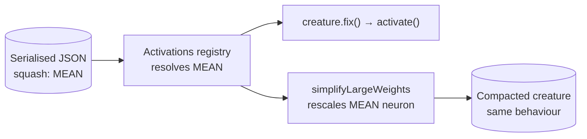

# Retain deprecated `MEAN` call sites deliberately (#3448)

## Summary

Issue #3448 flagged four `MEAN` references in production code (`Activations.ts`
import + registry entry, `SimplifyLargeWeights.ts` import + squash list) via the
TypeScript deprecation diagnostic. Unlike `HYPOTv2`, the `@deprecated` tag names
no replacement, so the issue asked for a migration decision: remove the call
sites, or keep them and mark them deliberate.

Investigation showed **both call sites are load-bearing for backwards
compatibility**, so they are retained:

- **Registry** (`src/methods/activations/Activations.ts:243`) — a serialised
  creature carrying `squash: "MEAN"` must still deserialise. Removing the
  registration makes `Activations.find` throw `ActivationError`, breaking
  existing coverage in `test/wasm/DeprecatedSquashTypeCompat.ts` and every
  fixture that carries `MEAN` (`test/data/traced.json`,
  `test/data/CRISPR/DNA-SANE.json`, …). `mutationProbability` is `0`, so
  evolution never selects it.
- **Compaction** (`src/compact/SimplifyLargeWeights.ts:62`) — `MEAN` is
  scale-homogeneous (`Σ(wᵢxᵢ)/n + b`), so dropping it from the supported-squash
  list would silently skip weight rescaling for those creatures.

There is no automatic rewrite for `MEAN` (`HYPOTv2` has one in
`src/upgrade/UpgradeTwo.ts`; `MEAN` does not) — replacing it with a standard
weighted neuron is a modelling choice for the model owner, not a mechanical
call-site edit.

Changes: added `// best-practice-ignore: BP-619a32c95d3a` markers with the
rationale at all four call sites, added regression tests that fail if either
call site is removed, and documented the missing automatic rewrite in
`docs/ACTIVATION_FUNCTIONS.md`.

Closes #3448.

## Evidence

Backend-only change — no web interface to screenshot. Evidence is the red/green
behaviour of the new tests.

Why both call sites must survive:



**Red check** — with `MEAN` deleted from `activationClasses`:

```text
MEAN: a serialised creature still deserialises, repairs and activates ... FAILED
  ActivationError: Unknown activation: MEAN
    at Activations.find (src/methods/activations/Activations.ts:117:13)
```

**Red check** — with `MEAN.NAME` deleted from the `simplifyLargeWeights`
candidate set:

```text
MEAN: simplifyLargeWeights rescales an imbalanced MEAN neuron ... FAILED
  AssertionError: MEAN is scale-homogeneous — expected a rescaling
```

**Green** — both call sites present, and the full gate:

```text
ok | 2 passed | 0 failed (27ms)
./quality.sh  →  ok | 8312 passed (5 steps) | 0 failed | 4 ignored (4m7s)
```

## Test Plan

Added `test/deprecated/MEANBackwardsCompatibility.ts`:

- `MEAN: a serialised creature still deserialises, repairs and activates` —
  loads a creature with a `MEAN` hidden neuron, calls `fix()` (which resolves
  the squash through the registry) and asserts the activation equals
  `(1*2 + 2*-3) / 2 + 0.5 = -1.5`. Guards the `Activations.ts` call site.
- `MEAN: simplifyLargeWeights rescales an imbalanced MEAN neuron` — calls
  `simplifyLargeWeights` directly on an export with a 1e6/1e-6 imbalance and
  asserts it rescales and reduces the weight/bias penalty. Guards the
  `SimplifyLargeWeights.ts` call site; existing coverage only reached this path
  indirectly through `compactCreature`.

No existing tests were modified or removed.
