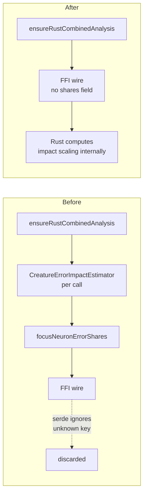

# Stop sending the deprecated `focusNeuronErrorShares` over the Discovery FFI

## Summary

`RustAnalysisCache.ts` built a `CreatureErrorImpactEstimator` on every
`analyze_parallel` call purely to populate `focusNeuronErrorShares`, a field
carrying an `@deprecated` tag with no stated replacement. Checking the consumer
settled the open question the issue left to a human: NEAT-AI-Discovery's
`AnalyzeParallelInput` (`src/ffi_types/requests.rs:93`) declares **no**
`focus_neuron_error_shares` field at all, and the struct does not use
`deny_unknown_fields` — serde silently discards the key. The shares were not
reaching Rust logging or anything else, so the retained "for logging/debugging"
rationale no longer holds.

This change therefore:

- drops the per-call `CreatureErrorImpactEstimator` construction and share loop
  from `ensureRustCombinedAnalysis`,
- removes `focusNeuronErrorShares` from the `parallelInput` wire literal, and
- retires the field from the `RustParallelAnalysisInput` type now that no caller
  remains.

`CreatureErrorImpactEstimator` itself is unchanged and still used by
`NeuronImpact.ts` for `expectedErrorReduction` normalisation — only the FFI
payload path stops computing it.

Closes #3449.

## Evidence

Backend/FFI change with no web interface, so no screenshot applies. Evidence is
the wire payload captured from a mocked `analyzeParallel`.

Before and after, on the payload handed to Rust:



Targeted run of the new tests:

```
running 2 tests from ./test/ErrorGuidedStructuralEvolution/AnalysisFocusNeuronErrorShares.ts
analysis request omits focusNeuronErrorShares (Issue #3449) ... ok
multi-focus analysis still sends focus neuron uuids (Issue #3449) ... ok

ok | 2 passed | 0 failed
```

Both assertions fail against the unfixed code (`Object.hasOwn(...)` returns
`true`), so they are genuine regression tests for the removal.

## Test Plan

- Added `test/ErrorGuidedStructuralEvolution/AnalysisFocusNeuronErrorShares.ts`:
  - `analysis request omits focusNeuronErrorShares (Issue #3449)` — captures the
    real `RustParallelAnalysisInput` via a mocked `analyzeParallel` and asserts
    the key is absent.
  - `multi-focus analysis still sends focus neuron uuids (Issue #3449)` —
    confirms the focus-neuron UUID list is untouched by the removal, with two
    focus neurons (hidden + output).
- Existing wire-payload suites still pass unchanged, including
  `AnalysisMemoryBudgetWiring.ts`, `DiscoveryTaskDescriptor.ts`,
  `AnalysisEnsureCombinedAnalysis.ts` and `AnalysisCacheRelease.ts`.
- Full `./quality.sh` gate run (fmt, lint, type-check, WASM sync, all tests).
