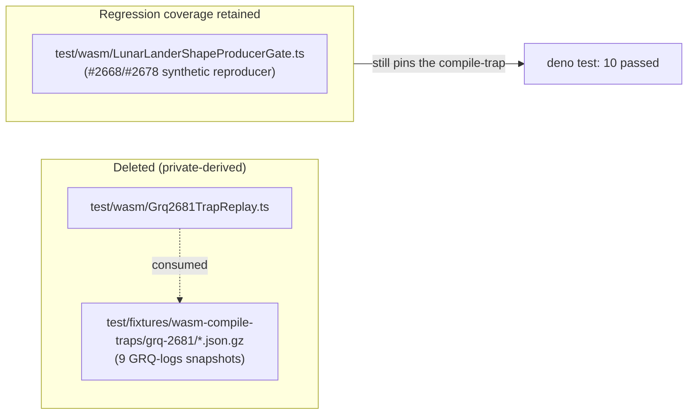

## Summary

Removed private-repo-derived data from this public repository. The nine gzipped
creature fixtures under `test/fixtures/wasm-compile-traps/grq-2681/`
(`offspring-wasm-compile-trap-offspring-2026-05-15T*.json.gz`, ~3.5 MB each raw)
were captured from the **private** `stSoftwareAU/GRQ-logs` repository (Develop
branch) during the May 2026 WASM compile-trap storm — the consuming test's own
header stated this. Committing private production snapshots into a public repo
fails check 2 of the `private-repo-reference` audit and points public readers at
a repository they cannot access.

This PR deletes the fixture directory and the replay test that consumed it
(`test/wasm/Grq2681TrapReplay.ts`). No source code changes are needed — the test
was self-contained and nothing else referenced the fixtures or the test.

The regression these fixtures pinned (`RuntimeError: unreachable` inside
`CompiledNetwork::new`) remains covered by the in-tree **synthetic** reproducer
from #2668/#2678 at `test/wasm/LunarLanderShapeProducerGate.ts`, which needs no
private data. The team may recreate a replay test inside the private repository
where the captured samples legitimately live.

Closes #3451.

## Evidence

Backend/test-only change — no web interface to screenshot.

Verification performed:

- `./quality.sh --lint-only` — passed (format, lint, bash checks clean).
- `./quality.sh --check-only` — passed (`deno check` across the tree, including
  the remaining `test/wasm/` files).
- Ran the surviving synthetic reproducer to confirm the regression is still
  pinned without the private fixtures:
  `deno test test/wasm/LunarLanderShapeProducerGate.ts test/wasm/WasmActivationTrapGuardIssue2658.ts`
  → `10 passed | 0 failed`.
- `grep` confirmed no remaining references to `grq-2681`, `Grq2681`, or
  `wasm-compile-traps` anywhere in the tree.

## Test Plan

- **Deleted** `test/wasm/Grq2681TrapReplay.ts` (the replay test) and the nine
  fixtures under `test/fixtures/wasm-compile-traps/grq-2681/`.
- **No new tests added** — this is a data/test removal. The compile-trap
  regression stays covered by the existing synthetic reproducer
  `test/wasm/LunarLanderShapeProducerGate.ts`, verified green above.
