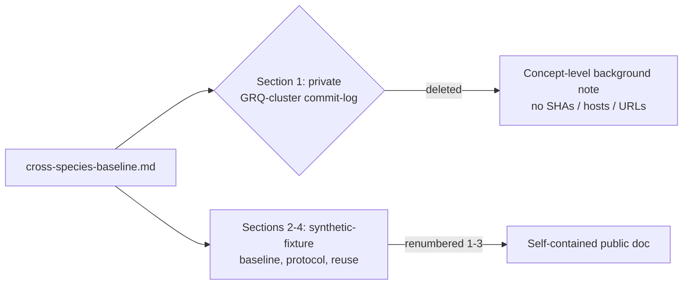

## Summary

Removed private-repo-derived data from the public cross-species breeding
baseline evidence doc. `docs/evidence/cross-species-baseline.md` section 1
committed a ~20-row table mined from the **private** `stSoftwareAU/GRQ-cluster`
repository — commit SHAs, timestamps, evolution scores, producer hosts and
shared-neuron counts — plus two direct Markdown links into that private repo
(the repo root and a specific commit). Publishing private-derived data in a
public repo leaks it, and the links point public readers at a repository they
cannot access, so the "evidence" was unverifiable outside the organisation.

The fix deletes section 1 (its table, Mermaid summary, and `GRQ-cluster` links)
and replaces it with a short concept-level background note — "production
commit-log analysis showed a flat trend with high noise" — that names no rows,
SHAs, hosts, or URLs. The remaining sections (the reproducible baseline built
from the in-tree synthetic fixtures `test/fixtures/cross-species/europa.json`
and `grq-cluster.json`, the statistical protocol, and the reuse snippet) are
fully self-contained and were renumbered 1–3. The document now stands alone for
public readers.

Closes #3452.

## Evidence

Backend/docs-only change — no web interface to screenshot. Verified by a new
regression test that walks the real doc and fails if any link into the private
`stSoftwareAU/GRQ-cluster` repo is present.

- Against the pre-fix doc the detector reported private-repo links on lines
  14 and 16; against the fixed doc it reports none.
- Full `./quality.sh` gate passes: `7839 passed | 0 failed | 4 ignored`.

## Test Plan

Added `test/docs/CrossSpeciesBaselineNoPrivateRepo.ts`:

- `cross-species baseline doc has no private GRQ-cluster links (#3452)` — reads
  the committed doc and asserts zero private-repo links (regression test:
  reproduces #3452, failed against the unfixed doc).
- `findPrivateRepoLinks flags a private-repo URL` — happy path.
- `findPrivateRepoLinks flags a private-repo commit URL` — commit-link variant.
- `findPrivateRepoLinks returns empty for self-contained prose` — negative case.
- `findPrivateRepoLinks returns empty for empty input` — edge case.
