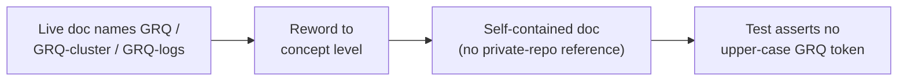

# Reword private GRQ references in live docs to concept level

## Summary

Live (non-archive) documentation named or linked the private `stSoftwareAU`
repositories `GRQ`, `GRQ-cluster` and `GRQ-logs`. A public repository must be
self-contained for public readers — a doc line that links a private repo 404s
and its named file paths are unverifiable. This PR rewords every such reference
to concept level, losing no information a public reader could act on. Closes
#3453.

Changes:

- `docs/comparison/PROS_AND_CONS.md` — replaced the Markdown link to
  `GRQ-cluster/network.json` with "a production-scale network snapshot"
  (retaining the concrete ~1,700 neurons / ~22,000 synapses / 2,461 inputs
  figures and the snapshot date).
- `docs/PROFILING_REPORT_3397.md` — "GRQ-cluster production topology" →
  "production topology"; "GRQ-cluster `network.json`" → "a production-scale
  network snapshot"; `GRQ/worker/learn.sh` / `ensure_neat_ai_native_scorer.sh` →
  "the downstream production runner scripts"; "GRQ-logs output" → "the
  production run logs"; the "GRQ" table cells → "downstream runner".
- `docs/VERSION_VISIBILITY.md` — "The GRQ-logs / Develop trap-sample storm" → "A
  May 2026 production trap-sample storm", and "Downstream consumers (GRQ and
  sibling repos)" → "Downstream consumers".

The in-tree lower-case `grq-3397` synthetic scale-preset name (a fixture in
`test/propagate/large/ProductionScaleCreature.ts`, not a private repo) is left
untouched — it is verifiable by public readers.

## Evidence

Documentation-only change — no web interface to screenshot. Verification is via
the new behavioural test that reads the real docs and asserts no upper-case
`GRQ` private-repo token remains:

```
deno test --allow-read test/docs/LiveDocsNoPrivateGrqReference.ts
ok | 8 passed | 0 failed
```



## Test Plan

- Added `test/docs/LiveDocsNoPrivateGrqReference.ts`:
  - `findPrivateGrqReferences` unit tests — flags `GRQ-cluster` / `GRQ-logs`,
    flags a bare `GRQ` repo name, ignores the lower-case `grq-3397` fixture,
    returns empty for concept-level prose and for empty input.
  - Per-doc regression tests over the three real live docs (`PROS_AND_CONS.md`,
    `PROFILING_REPORT_3397.md`, `VERSION_VISIBILITY.md`) asserting no private
    `GRQ*` reference. These fail against the unfixed docs and pass after the
    reword.
- `./quality.sh` run clean (lint, format, type-check, WASM sync, full test
  suite).
