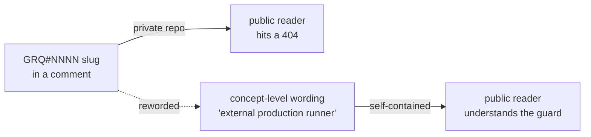

## Summary

Reworded private `stSoftwareAU/GRQ` issue-tracker references out of source and
test comments so the public repository stays self-contained. `stSoftwareAU/GRQ`
is a **private** repo, so a `GRQ#NNNN` slug (or a "GRQ repo" / "GRQ shell"
pointer) in a comment leads public readers to pages they cannot open. Each
comment now describes the behaviour being guarded at concept level (e.g. "a
Discovery worker was OOM-killed on a 16 GB production host, so the external
production runner exports a host-derived worker-memory envelope") and refers to
"the external production runner" rather than the private repo. Australian
English retained throughout. Closes #3454.

Reworded references (all `GRQ#NNNN` slugs and repo pointers removed):

- `src/config/DiscoveryWorkerEnvelope.ts` — module header slug and the "in the
  GRQ repo" runner pointer.
- `src/config/NeatConfig.ts` — two `Issue GRQ#3295:` comments.
- `test/config/DiscoveryWorkerEnvelope.ts` — header slug.
- `test/config/Grq22WorkerCap.ts` — header slug, "GRQ shell" pointers, and the
  `#3298` (private issue number) in three test names.
- `test/config/WorkerThreadCapConfig.ts` — `(GRQ#3295)` note.
- `test/creature/LoadFromObservability.ts` — `GRQ#1497`, `GRQ#1906` regression
  slugs.

The `GRQ-22` / `GRQ-cluster` / `GRQ-3` host/cluster/log **mnemonics** (no `#`)
are out of scope — they are not issue-tracker links — and are left unchanged.

## Evidence

Backend/comment-only change — no web interface to screenshot. Verified via a new
guard test plus the full quality gate.

New guard test `test/docs/NoPrivateGrqIssueSlugs.ts` walks the real `src/` and
`test/` trees and fails if any file reintroduces a `GRQ#NNNN` slug or a "GRQ
repo"/"GRQ shell" pointer, modelled on the existing
`test/docs/CrossSpeciesBaselineNoPrivateRepo.ts` audit test. It exercises
committed file content (behaviour), not the source text of any function.

Quality gate: `./quality.sh` → `7844 passed | 0 failed | 4 ignored`.

## Test Plan

- Added `test/docs/NoPrivateGrqIssueSlugs.ts`:
  - `no private GRQ issue-tracker slugs or repo pointers in src/ or test/` —
    scans the real trees; would fail against the pre-fix comments, passes after
    the rewording.
  - `findPrivateGrqRefs` unit cases: flags a `GRQ#` slug, an org-qualified
    `stSoftwareAU/GRQ#` slug, and a "GRQ repo" pointer; returns empty for
    self-contained prose (including the `GRQ-22` mnemonic) and for empty input.
- Re-ran the touched suites: `test/config/DiscoveryWorkerEnvelope.ts`,
  `test/config/Grq22WorkerCap.ts`, `test/config/WorkerThreadCapConfig.ts` (31
  passed) and `test/creature/LoadFromObservability.ts` — all green with the
  reworded comments.
