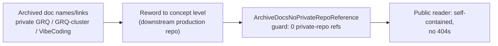

# Reword private-repo references in archived PR summaries and investigations

## Summary

Archived documentation directly named or linked the **private** `stSoftwareAU`
repositories `GRQ`, `GRQ-cluster` and `VibeCoding` — via a `GRQ-cluster`
`network.json` blob link, issue-tracker slugs (`GRQ#3472`,
`stSoftwareAU/GRQ#3508`, `stSoftwareAU/GRQ#3518`,
`stSoftwareAU/VibeCoding#3532`, `stSoftwareAU/GRQ#2109`), and org-qualified repo
names. A public repository must be fully self-contained: those links 404 for
public readers and the slugs point at issues they cannot open. Each reference is
reworded to concept level — "the downstream production repo", "the orchestration
repo's tracking issue", "the production `network.json` snapshot" — so the
archived narrative keeps its meaning without pointing at private targets. Closes
#3455.

Bare host/log/preset **mnemonics** (`GRQ-21`, `grq-3397`, `GRQ-side`,
`GRQ-3-rocket.log`) are intentionally kept — they name a concept, not a private
target, consistent with the #3454 decision. The public `stSoftwareAU/NEAT-AI`
issue link in the investigation doc is untouched.

Files reworded:

- `docs/archive/pr-summaries/pr-summary-3018.md` — dropped the `GRQ-cluster`
  `network.json` blob link and the `stSoftwareAU/GRQ-cluster` slug in favour of
  "the production `network.json` snapshot".
- `docs/archive/pr-summaries/pr-summary-3400.md` — three `stSoftwareAU/GRQ#3472`
  slugs and the surrounding `GRQ` repo pointers → "the downstream production
  repo".
- `docs/archive/pr-summaries/pr-summary-3410.md` — `GRQ#3472` and
  `stSoftwareAU/GRQ#3508` → concept-level downstream-repo wording.
- `docs/archive/pr-summaries/pr-summary-3412.md` — `stSoftwareAU/GRQ#3518` → "a
  cross-repo issue in the downstream production repo".
- `docs/archive/pr-summaries/pr-summary-3417.md` —
  `stSoftwareAU/VibeCoding#3532` (plus the same-class `VibeCoding#1613` /
  `VibeCoding#3532` slugs on nearby lines) → "the orchestration repo's tracking
  issue" / "the orchestration repo's dependency-bump contract".
- `docs/archive/investigations/issue-2515-forward-only-apply-audit.md` —
  `stSoftwareAU/GRQ#2109` → "a cross-repo issue in the downstream production
  repo".

## Evidence

Documentation-only change plus a guard test — no web interface to screenshot and
no runtime behaviour to benchmark. Verification is the new guard test and the
existing docs quality gates.

- The new guard `findPrivateRepoRefs` reports zero hits across all six reworded
  docs; it flags issue slugs (`GRQ#\d+`, `VibeCoding#\d+`), org-qualified
  private repo names, and private-repo links, while ignoring bare mnemonics and
  the public `stSoftwareAU/NEAT-AI` repo.
- `deno fmt --check`, `deno lint`, and `deno check` pass on the changed files.

## Test Plan

- Added `test/docs/ArchiveDocsNoPrivateRepoReference.ts`:
  - Six per-doc guards asserting each reworded archive file has no private-repo
    reference.
  - `findPrivateRepoRefs` unit cases — flags a bare `GRQ#` slug, an
    org-qualified `GRQ#` slug, a `VibeCoding#` slug, an org-qualified private
    repo name, and a private-repo blob URL; returns empty for bare mnemonics,
    the public `NEAT-AI` repo, concept-level prose, and empty input.
- Registered the new file in the `DETECTOR_TESTS` carve-out of
  `test/docs/NoPrivateGrqIssueSlugs.ts` so its literal `GRQ#`/`stSoftwareAU/GRQ`
  fixtures are not treated as offenders.
- `deno test --allow-read test/docs/*.ts` — 136 passed, 0 failed.
