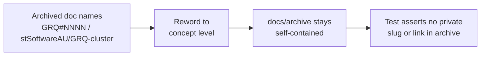

# Reword private repo references in archived PR summaries and investigations

## Summary

Archived documentation directly pointed public readers at private `stSoftwareAU`
repositories (`GRQ`, `GRQ-cluster`, `VibeCoding`). A public repository must be
fully self-contained: archived or not, these files ship in every public clone,
and each private issue slug or blob link 404s for anyone outside the
organisation. This PR rewords each private-repo pointer to concept level while
preserving the archived narrative's meaning. Closes #3455.

Reworded references (all private issue slugs and org-qualified repo links
removed):

- `docs/archive/pr-summaries/pr-summary-3018.md` — dropped the
  `github.com/stSoftwareAU/GRQ-cluster/blob/main/network.json` link and the
  `stSoftwareAU/GRQ-cluster` source pointer in favour of "the production
  `network.json` snapshot".
- `docs/archive/pr-summaries/pr-summary-3400.md` — three `stSoftwareAU/GRQ#3472`
  slugs → "a cross-repo issue in the downstream production repo".
- `docs/archive/pr-summaries/pr-summary-3410.md` — `GRQ#3472` and
  `stSoftwareAU/GRQ#3508` → "the downstream production repo".
- `docs/archive/pr-summaries/pr-summary-3412.md` — `stSoftwareAU/GRQ#3518` → "a
  cross-repo issue in the downstream production repo".
- `docs/archive/pr-summaries/pr-summary-3417.md` —
  `stSoftwareAU/VibeCoding#3532` (and the sibling `VibeCoding#1613` /
  `VibeCoding#3532` pointers on the same page) → "the orchestration repo's
  tracking issue" / "the orchestration repo's dependency-bump contract".
- `docs/archive/investigations/issue-2515-forward-only-apply-audit.md` —
  `stSoftwareAU/GRQ#2109` → "the downstream production repo".

Bare host/cluster/log **mnemonics** without a `#` slug or org-qualified path
(`GRQ-23`, `GRQ-cluster`, `GRQ-3`) are left as narrative, consistent with the
scope of the private-repo-reference audit and the prior #3454 decision.

The audit-narrative summaries `pr-summary-3452.md` and `pr-summary-3454.md`
necessarily embed the private-repo patterns to record _what_ they removed, so
they are exempted from the new guard (they are the audit, not offenders).

## Evidence

Documentation-and-test change only (no TypeScript runtime behaviour, no UI to
screenshot). Verification via the new detector test and the quality gate:

- `deno test test/docs/ArchiveDocsNoPrivateRepoSlugs.ts` — the archive-scan test
  fails against the unfixed docs (six offender files) and passes after the
  reword.
- `markdownlint-cli2` over `docs/archive/**/*.md` — 0 errors.
- `deno fmt` / `deno lint` on the changed files — clean.

## Test Plan

Added `test/docs/ArchiveDocsNoPrivateRepoSlugs.ts`:

- `no private stSoftwareAU repo slugs or links in docs/archive (#3455)` — walks
  the real `docs/archive/` tree and asserts no file (outside the audit-narrative
  allowlist) carries a private issue slug or org-qualified repo link. This is
  the regression test that reproduces the finding: it fails against the unfixed
  archive and passes after this PR.
- `findPrivateRepoRefs` unit cases — flags a bare `GRQ#` slug, an org-qualified
  `stSoftwareAU/GRQ#` slug, a `VibeCoding#` slug, a `stSoftwareAU/GRQ-cluster`
  path, and a `GRQ-cluster` blob link; returns empty for concept-level prose
  (including bare `GRQ-cluster` / `GRQ-23` mnemonics) and for empty input.

Registered the new detector in `test/docs/NoPrivateGrqIssueSlugs.ts`'s
`DETECTOR_TESTS` allowlist so its own `GRQ#` fixtures are not flagged by the
#3454 `src/`/`test/` scan.
