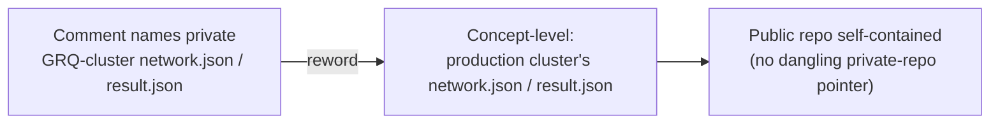

## Summary

Reworded incidental code-comment and fixture-README mentions of the **private**
`GRQ-cluster` repository (and its `network.json` / `result.json` files) to
concept-level wording, so this public repository stays self-contained for public
readers (check 3 of the `private-repo-reference` audit). No behaviour, fixtures,
or public API changed — the change is comment/documentation only. Closes #3456.

The private-repo name `GRQ-cluster` is replaced with "the production cluster's
…" / "production-cluster …" throughout the flagged comments, while the
**functional** scale-preset string literals (`"grq-cluster"`, `"grq-3397"`) are
deliberately left untouched — they are API values validated by `--scale` parsing
and by `SCALE_CONFIGS`, and renaming them would be a behaviour change the issue
explicitly excludes.

### Files reworded

| File                                                | What changed                                                                                                                                                   |
| --------------------------------------------------- | -------------------------------------------------------------------------------------------------------------------------------------------------------------- |
| `bench/ProductionLearnSamplerProfile.ts`            | Header + section comment: "GRQ-cluster production topology" → "production cluster's topology".                                                                 |
| `src/creature/ScorerUtilisationTotals.ts`           | Doc comment: "in the GRQ-cluster `result.json`" → "in the production cluster's `result.json`".                                                                 |
| `test/architecture/FitnessBatchPathUsed.ts`         | Doc comment: same `result.json` reword.                                                                                                                        |
| `test/bench/ProductionScaleEvolveDirProfile.ts`     | Comments, test name, and assert messages: "GRQ-cluster" → "production-cluster". Preset literal `scale: "grq-cluster"` kept.                                    |
| `test/propagate/large/ProductionScaleCreature.ts`   | Preset doc comments: "GRQ production" / "GRQ-cluster production `network.json`" → "production-cluster" / "production cluster's `network.json`". Literals kept. |
| `test/breed/SyntheticLocationE2E.ts`                | Doc comment: "GRQ-cluster `network.json`" → "production cluster's `network.json`".                                                                             |
| `test/breed/fixtures/synthetic-alignment/README.md` | Provenance note: same `network.json` reword.                                                                                                                   |
| `CHANGELOG.md`                                      | Unreleased entries (#3422, #3427): "GRQ-cluster" → "production cluster".                                                                                       |

### Out of scope (intentionally left)

- Functional preset identifiers `"grq-cluster"` / `"grq-3397"` and the `--scale`
  values in `bench/score_per_hour_harness.ts` /
  `bench/evolution_config_sweep.ts` — these are code, not incidental name
  mentions; changing them is a behaviour change the issue excludes.
- Unrelated `GRQ` mentions not enumerated by finding `BP-016c5410cfce` (e.g. the
  `GRQ-teams` name and `GRQ`-as-fleet mentions in `CHANGELOG.md:193,286`). These
  are a different name/class from `GRQ-cluster` and are left for their own
  finding to avoid scope creep.

## Evidence

Backend/comment-only change — no web interface to screenshot. Verification is
the full quality gate:

- `./quality.sh < /dev/null` → **exit 0**, `7889 passed | 0 failed | 4 ignored`.
- `grep -n "GRQ-cluster" <touched files>` → no matches (the private-repo name is
  gone from every flagged location; only functional `"grq-cluster"` literals
  remain).

## Test Plan

No unit tests were added. This is a pure comment/documentation reword with **no
behavioural surface** to assert on, and the project's testing policy
(`AGENTS.md` → "How tests to avoid") explicitly forbids tests that grep source
files for patterns or inspect comment content — such a test would be a forbidden
"how" test that breaks on any refactor. Correctness is instead guaranteed by the
existing suite continuing to pass unchanged:

- Full `./quality.sh` run: `7889 passed | 0 failed` — including
  `test/bench/ProductionScaleEvolveDirProfile.ts` (whose renamed test still
  drives real creature generation and asserts on dimensions) and
  `test/breed/SyntheticLocationE2E.ts`.
