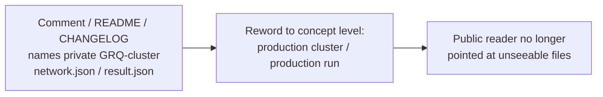

## Summary

Reworded the incidental code-comment, fixture-README, and CHANGELOG mentions of
the **private** `GRQ-cluster` repository to concept level, so a public reader is
no longer pointed at files they cannot see (check 3 of the
`private-repo-reference` audit). Only naming changed — no behaviour, no fixture,
and no scale-preset identifier (`grq-cluster` / `grq-3397` string literals) was
touched. Closes #3456.

The private repo name plus its `network.json` / `result.json` file references
were replaced with equivalent concept-level wording ("the production cluster's
`network.json`-scale topology", "the production run's `result.json`", "every
production snapshot").

### Reworded locations (exactly the audit-enumerated mentions)

| File                                                       | Change                                                                                                                                                           |
| ---------------------------------------------------------- | ---------------------------------------------------------------------------------------------------------------------------------------------------------------- |
| `bench/ProductionLearnSamplerProfile.ts` (6, 39)           | "GRQ-cluster production topology … production `network.json`" → concept level                                                                                    |
| `src/creature/ScorerUtilisationTotals.ts` (12)             | "GRQ-cluster `result.json`" → "the production run's `result.json`"                                                                                               |
| `test/architecture/FitnessBatchPathUsed.ts` (12)           | "GRQ-cluster `result.json`" → "the production run's `result.json`"                                                                                               |
| `test/bench/ProductionScaleEvolveDirProfile.ts` (43)       | "GRQ-cluster production `network.json`" → "the production cluster's `network.json`-scale topology"                                                               |
| `test/breed/SyntheticLocationE2E.ts` (6)                   | "GRQ-cluster `network.json`" → "the production cluster's `network.json` shape"                                                                                   |
| `test/breed/fixtures/synthetic-alignment/README.md` (13)   | "GRQ-cluster `network.json` shape" → "the production cluster's `network.json` shape"                                                                             |
| `test/propagate/large/ProductionScaleCreature.ts` (53, 84) | "GRQ-cluster production `network.json`" → "the production cluster's `network.json`-scale topology" (both copies of the same private-file reference in this file) |
| `CHANGELOG.md` (29, 94)                                    | "GRQ-cluster's `result.json`" / "every GRQ-cluster snapshot" → "the production run's `result.json`" / "every production snapshot"                                |

### Deliberately left in scope-respecting places

- Lower-case code identifiers — the `scale: "grq-cluster"` / `"grq-3397"` preset
  names, the `grq-cluster.json` fixture filename — are behaviour, not prose, and
  are unchanged.
- Bare cluster/host **mnemonics** that are not private-file references (e.g.
  "GRQ-cluster dimensions/target" in
  `test/bench/ProductionScaleEvolveDirProfile.ts`, and the `GRQ`/`GRQ logs`
  mnemonics in `CHANGELOG.md` lines 193/286) stay as narrative, consistent with
  the existing mnemonics carve-out. The audit did not flag these.
- The `test/docs/*NoPrivateRepoReference*` audit tests intentionally contain the
  `GRQ-cluster` string as detection fixtures and are untouched.

## Evidence

Documentation/comment-only change — no web interface to screenshot. A broad
source-scan regression test was **not** added: it would over-reach the audit's
precise scope (the same files legitimately retain lower-case preset identifiers
and mnemonic references), and the repo guidelines explicitly discourage tests
that grep source text for patterns. Correctness is covered by the existing
quality gate:

- `./quality.sh --lint-only` — format + lint clean (2210 files formatted, 1855
  linted).
- `./quality.sh --check-only` — `deno check` type-checks the whole tree cleanly,
  confirming every edited comment block still compiles.
- `deno test test/bench/ProductionScaleEvolveDirProfile.ts` — 2 passed / 0
  failed, confirming the edited test file still runs.

## Test Plan

- Re-ran `test/bench/ProductionScaleEvolveDirProfile.ts` (one of the edited
  files) — both structural tests pass.
- `./quality.sh --lint-only` and `./quality.sh --check-only` pass cleanly with
  the changes.
