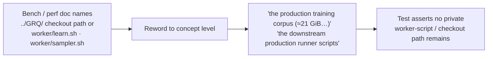

# PR Summary — Reword private GRQ worker-script and checkout paths (Issue #3457)

## Summary

Reworded the private-repo **file-path** references in the benches and
performance docs to concept level, so the public repository stays fully
self-contained. The private `stSoftwareAU/GRQ` repo was referenced by two path
shapes the uppercase-`GRQ` audit (`LiveDocsNoPrivateGrqReference.ts`) does not
catch, because they do not spell out the `GRQ` token:

- the sibling-checkout path `../GRQ/.trainData-binary_115` (the ≈21 GiB
  production training corpus), and
- the downstream runner script paths `worker/learn.sh` / `worker/sampler.sh`.

These pointed public readers at files they cannot see and advertised the private
repo's internal layout. No behaviour changes — the benches already run on
synthetic in-tree fixtures. **Closes #3457.**

### Reworded references

| File                                                                | Was                                                                                                | Now                                                                                             |
| ------------------------------------------------------------------- | -------------------------------------------------------------------------------------------------- | ----------------------------------------------------------------------------------------------- |
| `bench/SquashBudgetSelection.ts` (10–13)                            | "The full GRQ A/B … `../GRQ/.trainData-binary_115`"                                                | "The full production A/B … the production training corpus (≈21 GiB, not distributable)"         |
| `docs/archive/pr-summaries/pr-summary-3263.md` (66)                 | "`../GRQ/.trainData-binary_115`"                                                                   | "the production training corpus (≈21 GiB, not distributable)"                                   |
| `docs/EVOLUTION_CONFIG_SWEEP_3400.md` (4–5, 92, 131, 135, 140, 145) | "`worker/learn.sh` / `worker/sampler.sh` (GRQ) scripts", "the GRQ scripts", "cross-repo GRQ issue" | "the downstream production runner scripts", "the issue filed in the downstream production repo" |
| `docs/SCORE_PER_HOUR_HARNESS.md` (26)                               | "`worker/learn.sh` / `worker/sampler.sh`"                                                          | "the downstream production runner scripts"                                                      |

Bare host/preset **mnemonics** (`grq-3397`, and bare `GRQ` tokens outside these
path references) are out of this finding's scope — they name a concept, not a
private path — and are handled by the separate live/archive `GRQ`-token audits
(#3453–#3456).

## Evidence

Documentation-only reword — no web interface to screenshot. Verified via the new
audit test plus the full `./quality.sh` gate (`7945 passed | 0 failed`).

## Test Plan

Added `test/docs/BenchAndPerfDocsNoPrivateWorkerPaths.ts` (behaviour test —
reads real file content, asserts on it; fails against the unfixed files and
passes after the reword):

- `findPrivateWorkerScriptPaths` unit cases — flags the `worker/learn.sh` /
  `worker/sampler.sh` runner scripts, flags a `../GRQ/.trainData-binary_*`
  sibling-checkout path, ignores the lower-case `grq-3397` fixture, and returns
  empty for concept-level prose and empty input.
- Per-file scans over the four target files (`bench/SquashBudgetSelection.ts`,
  `docs/archive/pr-summaries/pr-summary-3263.md`,
  `docs/EVOLUTION_CONFIG_SWEEP_3400.md`, `docs/SCORE_PER_HOUR_HARNESS.md`)
  assert no private worker-script or checkout path remains.

Full `./quality.sh` passes (`7945 passed | 0 failed`).
