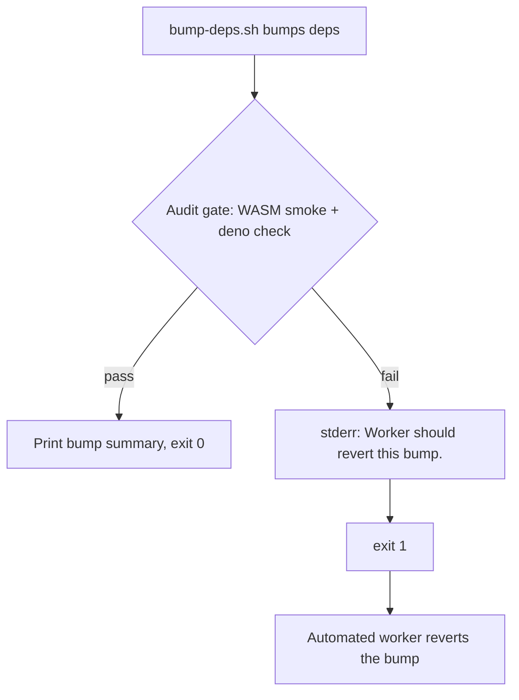

# Reword private-repo issue-contract references to concept level

## Summary

Live dependency-bump automation, contributor docs, and a test comment referenced
a **private** organisation issue tracker via `<repo>#NNNN` issue slugs —
including **two lines printed to stderr at runtime**. Those slugs are
meaningless to public readers (the tracker is private, so the reference cannot
be followed), which breaks the "a public repository must be self-contained"
rule. The behaviour they described — the automated dependency-bump worker
reverting a bump when a gate fails — is fully expressible without the slug.

This change rewords each reference to concept level:

- `bump-deps.sh:8` — header now credits "the automated dependency-bump worker
  before quality.sh", no slug.
- `bump-deps.sh:32` — "The worker then reverts the bump."
- `bump-deps.sh:165` — "The real fix is worker-side PATH bootstrap; this is a
  local hardening layer."
- `bump-deps.sh:341` and `bump-deps.sh:362` — the two runtime stderr lines now
  read `Worker should revert this bump.`
- `AGENTS.md:600` — "the Vibe Coder worker reverts the bump."
- `test/scripts/BumpDepsScript.ts:8` — header comment drops the slug.

No control flow changed — only comment text, doc prose, and two stderr strings.

Closes #3458.

## Evidence

Backend/CLI-only change; no web interface to screenshot.

Repo-wide scan confirms the target files no longer carry a private-repo slug
(remaining hits live only in the private-repo-reference **audit tests**, which
intentionally hold the slug as detection fixtures/regexes and are out of scope):

```
$ grep -rn "VibeCoding" bump-deps.sh AGENTS.md test/scripts/BumpDepsScript.ts
(no matches)
```

The gate-failure flow that emits the reworded stderr line:



### Quality gate

`deno fmt --check`, `deno lint` (2242 files) and `deno check` (1904 files) are
clean, and all 307 tests under `test/docs/` + `test/scripts/` pass. Two full
`./quality.sh` runs hit unrelated flakiness in the heavy evolve suite — one
`test/creature/FitnessSubsampleEvaluateDir.ts` failure that passes in isolation,
and one `deno` process SIGTRAP (exit 133) under memory pressure. Neither can be
caused by this change, which touches comment and message text only.

## Test Plan

- Ran the existing behavioural suite `test/scripts/BumpDepsScript.ts` (13 tests,
  all passing) — flag parsing, quarantine validation, `--dry-run` no-op, and the
  deno-fallback paths still behave identically after the reword.
- `deno fmt --check` and `deno lint` pass on the changed files.
- `bash -n bump-deps.sh` confirms the script still parses.

No new test was added: the change is a pure textual reword with no new
behaviour, no existing test asserts on the reworded strings, and a
grep-of-source test would be a discouraged non-behavioural check. Exercising the
reworded stderr line directly requires forcing the network-dependent
gate-failure path, which the unit suite deliberately avoids.
