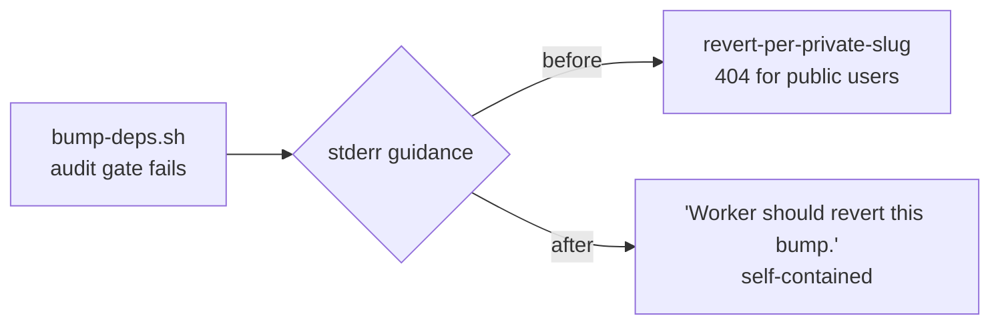

# Reword private issue-contract references to concept level

## Summary

Live dependency-bump automation, contributor documentation and a test comment
cited the **private** orchestration repository's issue tracker by slug. Two of
those slugs were printed to stderr by `bump-deps.sh` at runtime, so any public
user whose bump failed an audit gate was pointed at an issue they cannot open.

Each reference is now worded at concept level — describing the revert contract
itself rather than naming a private tracker item:

| Location                           | After                                                         |
| ---------------------------------- | ------------------------------------------------------------- |
| `bump-deps.sh:8`                   | `(see "WASM smoke audit gate in bump-deps.sh" in AGENTS.md)`  |
| `bump-deps.sh:32`                  | `The automated dependency-bump worker then reverts the bump.` |
| `bump-deps.sh:165`                 | `PATH bootstrap in the automation that spawns us`             |
| `bump-deps.sh:341,362` (stderr)    | `Worker should revert this bump.`                             |
| `AGENTS.md:600`                    | `the automated dependency-bump worker reverts the bump`       |
| `test/scripts/BumpDepsScript.ts:8` | slug dropped; the worker is described generically             |

No behaviour changed — the audit gates still fail loud with exit 1; only the
wording of the guidance changed.

Closes #3458.

## Evidence

This is a documentation/CLI-text change with no web interface, so no screenshot
applies. Verification is by test:

```
deno test --allow-read test/scripts/BumpDepsNoPrivateRepoReference.ts
ok | 10 passed | 0 failed (8ms)
```

The new test fails against the unfixed tree (4 failures: `bump-deps.sh`,
`AGENTS.md`, `test/scripts/BumpDepsScript.ts`, and the runtime revert-guidance
check) and passes after the rewording.

Full gate: `./quality.sh` → `ok | 7955 passed (5 steps) | 0 failed | 4 ignored`.
`shellcheck bump-deps.sh` and `bash -n bump-deps.sh` are both clean.



## Test Plan

Added `test/scripts/BumpDepsNoPrivateRepoReference.ts` (10 tests):

- Per-file scans of `bump-deps.sh`, `AGENTS.md` and
  `test/scripts/BumpDepsScript.ts` for a private issue slug or org-qualified
  private repo path (regression guard, 3 tests).
- `bump-deps.sh revert guidance is worded at concept level` — asserts both audit
  gates still emit revert guidance and that neither line cites a private
  tracker.
- `findVibeCodingReferences` unit coverage: bare slug, org-qualified blob link,
  multiple offending lines, public `NEAT-AI` link not flagged, concept-level
  prose not flagged, and the empty-input edge case.

No existing tests were removed or modified beyond the comment rewording in
`test/scripts/BumpDepsScript.ts`.
